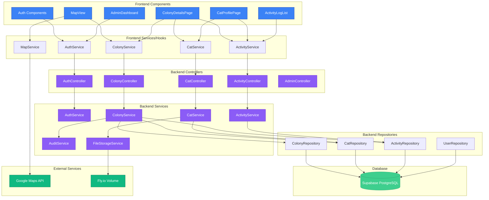

# Components

This section identifies the major logical components across the fullstack architecture, defining their boundaries, responsibilities, interfaces, and dependencies. Components are organized by architectural layer: Frontend (React), Backend (Spring Boot), and Shared (cross-stack).

## Component Organization Principles

- **Single Responsibility:** Each component has one clear purpose
- **Loose Coupling:** Components communicate through well-defined interfaces
- **High Cohesion:** Related functionality grouped together
- **Technology Alignment:** Component boundaries respect framework conventions (React components, Spring services)
- **Testability:** Components designed for unit testing with mocks

---

## Frontend Components (React/TypeScript)

### 1. Authentication Components

**Responsibility:** User authentication flows (login, registration, password reset)

**Key Components:**
- `LoginForm` - Email/password login form
- `RegisterForm` - Multi-step registration with verification document upload
- `ForgotPasswordForm` - Password reset email request
- `PendingApprovalPage` - Waiting screen for admin verification (FR3)

**Dependencies:**
- `AuthService` (API client)
- `useAuth` hook (authentication state)
- React Hook Form (form validation)

**State Management:**
- JWT token stored in localStorage
- User profile in TanStack Query cache
- Login state in React Context

**Technology:**
- React Hook Form for form handling
- Zod for client-side validation
- TanStack Query for login mutation

**Example Interface:**
```typescript
interface LoginFormProps {
  onSuccess: (user: User, token: string) => void;
  onError: (error: Error) => void;
}
```

**PRD Reference:** FR1, FR2, FR3, FR4, FR5

---

### 2. Map Components

**Responsibility:** Interactive map display with colony markers and search

**Key Components:**
- `MapView` - Google Maps container with markers
- `ColonyMarker` - Individual colony pin with thumbnail
- `SearchBar` - Always-visible search input (FR12)
- `FilterPanel` - Sliding panel with filter options (FR17)
- `MapControls` - Zoom, center on user location, add colony button

**Dependencies:**
- `@vis.gl/react-google-maps` library (modern React wrapper for Google Maps)
- `MapService` (geocoding, distance calculations)
- `ColonyService` (fetch colonies with filters)
- Google Maps JavaScript API

**State Management:**
- Map center/zoom in local state
- Colony markers from TanStack Query
- Selected colony in URL params (React Router)
- Filter state in URL query params (shareable links)

**Technology:**
- `@vis.gl/react-google-maps` - Official vis.gl library for Google Maps in React
- Custom hooks: `useMap`, `useMapMarkers`, `useUserLocation`, `useMapSearch`
- Marker clustering for performance (>50 colonies)

**Performance Optimization:**
- Marker clustering with `@googlemaps/markerclusterer`
- Lazy loading map tiles
- Debounced search input (300ms)
- Memoized marker components

**Example Interface:**
```typescript
interface MapViewProps {
  colonies: Colony[];
  userLocation: { latitude: number; longitude: number } | null;
  onColonyClick: (colonyId: string) => void;
  onAddColony: (coordinates: { latitude: number; longitude: number }) => void;
}
```

**PRD Reference:** FR7, FR8, FR9, FR10, FR11, FR12, FR13, FR15, FR16, FR26

---

### 3. Colony Components

**Responsibility:** Colony details, cat list, and colony management

**Key Components:**
- `ColonyDetailsPage` - Main colony view with tabs
- `ColonyHeader` - Colony name (editable), cat count, TNR progress
- `ColonyInfoCard` - Address, last fed status, creator info
- `CatList` - Clickable list of cats with thumbnails
- `ActivityLogSection` - Colony activity feed
- `AddCatButton` - Quick-add cat modal (FR32)
- `EditColonyModal` - Edit colony name/address

**Dependencies:**
- `ColonyService` (CRUD operations)
- `CatService` (fetch cats in colony)
- `ActivityService` (fetch colony activities)
- `useColony` hook (TanStack Query)

**State Management:**
- Colony data from TanStack Query (`queryKey: ['colonies', colonyId]`)
- Cat list from TanStack Query (`queryKey: ['colonies', colonyId, 'cats']`)
- Edit mode in local state
- Optimistic updates for name changes

**Technology:**
- TanStack Query for data fetching
- Optimistic updates via `onMutate`/`onError`/`onSettled`
- React Hook Form for edit modals

**Example Interface:**
```typescript
interface ColonyDetailsPageProps {
  colonyId: string; // From React Router params
}
```

**PRD Reference:** FR29, FR30, FR32, FR36, FR42, FR52, FR53

---

### 4. Cat Components

**Responsibility:** Cat profile display and editing

**Key Components:**
- `CatProfilePage` - Comprehensive cat profile
- `CatPhotoGallery` - Carousel with max 10 photos (FR50)
- `CatInfoCard` - Status, basic info, health, TNR, behavior sections
- `CatActivityLog` - Cat-specific activity feed
- `EditCatModal` - Edit cat profile form
- `UpdateStatusModal` - Status change with notes (FR34)
- `AddPhotoButton` - Photo upload (max 10 total)

**Dependencies:**
- `CatService` (CRUD operations)
- `ActivityService` (fetch cat activities)
- `useCat` hook (TanStack Query)
- `usePhotoUpload` hook

**State Management:**
- Cat data from TanStack Query (`queryKey: ['cats', catId]`)
- Photo upload progress in local state
- Edit mode toggle

**Technology:**
- Image optimization (resize before upload)
- Drag-and-drop photo upload
- TanStack Query mutations for updates

**Example Interface:**
```typescript
interface CatProfilePageProps {
  catId: string; // From React Router params
}
```

**PRD Reference:** FR33, FR34, FR35, FR37, FR43, FR50

---

### 5. Activity Components

**Responsibility:** Activity logging and display

**Key Components:**
- `ActivityLogList` - Paginated activity feed
- `ActivityLogItem` - Single activity card with user, timestamp, action
- `LogActivityModal` - Activity logging form (category → action → details)
- `ActivityFilterBar` - Time filter dropdown (Today, All Time, Date Range - FR48)
- `ActivityPhotoUpload` - Photo upload (max 3 per activity - FR51)

**Dependencies:**
- `ActivityService` (create, fetch activities)
- `useActivities` hook (TanStack Query)

**State Management:**
- Activities from TanStack Query with filter params in queryKey
- Form state in React Hook Form
- Photo upload state (base64 previews)

**Technology:**
- Conditional dropdowns (category determines action options)
- Date/time picker for `activityTimestamp`
- Optimistic UI updates for activity submission

**Example Interface:**
```typescript
interface LogActivityModalProps {
  colonyId?: string; // Set for colony-level activities
  catId?: string;    // Set for cat-specific activities
  onSuccess: (activity: Activity) => void;
}
```

**PRD Reference:** FR36, FR37, FR38, FR39, FR40, FR41, FR42, FR43, FR48, FR51

---

### 6. Admin Components

**Responsibility:** User verification and admin panel

**Key Components:**
- `AdminDashboard` - Admin panel with pending users
- `PendingUsersList` - Table of users awaiting approval
- `UserVerificationCard` - User details with verification documents
- `ApproveUserButton` - Approve action with confirmation
- `RejectUserModal` - Reject with reason input

**Dependencies:**
- `AdminService` (admin operations)
- `useAuth` hook (check admin role)
- `usePendingUsers` hook (TanStack Query)

**State Management:**
- Pending users from TanStack Query
- Approval/rejection in progress (loading states)

**Authorization:**
- Route protected by Admin/SuperAdmin role guard
- Component renders only if `user.role === 'ADMIN' || user.role === 'SUPER_ADMIN'`

**Example Interface:**
```typescript
interface UserVerificationCardProps {
  user: User;
  onApprove: (userId: string) => void;
  onReject: (userId: string, reason: string) => void;
}
```

**PRD Reference:** FR2, FR6

---

### 7. Shared UI Components

**Responsibility:** Reusable UI components across the app

**Key Components:**
- `Button` - Primary, secondary, danger variants (from Untitled UI)
- `Card` - Container component with shadow/border
- `Modal` - Dialog wrapper with backdrop
- `Input` - Form input with validation states
- `Select` - Dropdown with search
- `DatePicker` - Date/time selection
- `FileUpload` - Drag-and-drop file input
- `LoadingSpinner` - Loading indicator
- `ErrorBoundary` - React error boundary
- `Toast` - Notification system (success/error/info)

**Technology:**
- Untitled UI component library (Tailwind-based)
- Headless UI for accessible components
- Custom Tailwind utility classes

**Design System:**
- Mobile-first responsive design
- Touch-friendly tap targets (44x44px minimum)
- Consistent spacing scale (4px, 8px, 16px, 24px, 32px, 48px)
- Color palette: Primary (purple), Success (green), Danger (red), Neutral (gray)

---

## Backend Components (Spring Boot/Java)

### 8. Controller Layer

**Responsibility:** HTTP request handling, input validation, response formatting

**Key Controllers:**
- `AuthController` - Authentication endpoints (`/api/auth/*`)
- `ColonyController` - Colony CRUD (`/api/colonies/*`)
- `CatController` - Cat CRUD (`/api/cats/*`)
- `ActivityController` - Activity logging (`/api/activities/*`)
- `AdminController` - Admin operations (`/api/admin/*`)
- `SearchController` - Global search (`/api/search`)

**Technology:**
- Spring Web MVC `@RestController`
- Jakarta Bean Validation (`@Valid`, `@NotNull`, etc.)
- `@PreAuthorize` for method-level security
- Springdoc OpenAPI annotations

**Responsibilities:**
- Deserialize request JSON to DTOs
- Validate input with annotations
- Call service layer methods
- Serialize response DTOs to JSON
- Handle exceptions (via `@ExceptionHandler`)

**Example:**
```java
@RestController
@RequestMapping("/api/colonies")
@RequiredArgsConstructor
public class ColonyController {
    
    private final ColonyService colonyService;
    
    @GetMapping("/{id}")
    @PreAuthorize("hasRole('USER')")
    public ResponseEntity<ColonyDTO> getColony(@PathVariable UUID id) {
        ColonyDTO colony = colonyService.getColonyById(id);
        return ResponseEntity.ok(colony);
    }
}
```

---

### 9. Service Layer

**Responsibility:** Business logic, transaction management, data orchestration

**Key Services:**
- `AuthService` - User registration, login, JWT generation
- `ColonyService` - Colony CRUD, computed fields calculation, duplicate detection
- `CatService` - Cat CRUD, photo management, status updates
- `ActivityService` - Activity logging, filtering, time-based queries
- `AdminService` - User approval/rejection, verification
- `AuditService` - Audit event creation, logging
- `GeocodingService` - Address ↔ coordinates conversion (Google Geocoding API)
- `FileStorageService` - Photo upload/retrieval from Fly.io volume

**Technology:**
- `@Service` annotation
- `@Transactional` for database transactions
- Constructor injection with Lombok `@RequiredArgsConstructor`

**Responsibilities:**
- Implement business rules (e.g., duplicate colony detection within 1m - FR24)
- Calculate computed fields (`catCount`, `lastFedAt`, `tnrProgress`)
- Coordinate multiple repository calls
- Trigger audit events
- Handle file uploads/storage
- Call external APIs (Google Maps, etc.)

**Example:**
```java
@Service
@RequiredArgsConstructor
@Transactional
public class ColonyService {
    
    private final ColonyRepository colonyRepository;
    private final CatRepository catRepository;
    private final ActivityRepository activityRepository;
    private final AuditService auditService;
    
    public ColonyDTO getColonyById(UUID id) {
        Colony colony = colonyRepository.findById(id)
            .orElseThrow(() -> new NotFoundException("Colony not found"));
        
        // Calculate computed fields
        int catCount = catRepository.countByColonyIdAndStatusNot(id, CatStatus.DECEASED);
        Instant lastFedAt = activityRepository.findLastFeedingTime(id).orElse(null);
        TnrProgress tnrProgress = calculateTnrProgress(id);
        
        return ColonyDTO.fromEntity(colony, catCount, lastFedAt, tnrProgress);
    }
}
```

---

### 10. Repository Layer

**Responsibility:** Database access, query execution

**Key Repositories:**
- `UserRepository` - User CRUD, find by email
- `ColonyRepository` - Colony CRUD, geospatial queries, duplicate detection
- `CatRepository` - Cat CRUD, filter queries, count queries
- `ActivityRepository` - Activity CRUD, time-based queries, aggregations
- `AuditEventRepository` - Audit event storage (append-only)

**Technology:**
- Spring Data JPA `JpaRepository<Entity, UUID>`
- Custom queries with `@Query` annotation (JPQL or native SQL)
- Query derivation from method names
- `Pageable` for pagination

**Example:**
```java
@Repository
public interface CatRepository extends JpaRepository<Cat, UUID> {
    
    @Query("SELECT COUNT(c) FROM Cat c WHERE c.colony.id = :colonyId AND c.status != :status")
    int countByColonyIdAndStatusNot(
        @Param("colonyId") UUID colonyId,
        @Param("status") CatStatus status
    );
    
    @Query("SELECT c FROM Cat c WHERE c.colony.id = :colonyId AND c.isNeutered = true")
    List<Cat> findNeuteredCatsByColony(@Param("colonyId") UUID colonyId);
    
    Page<Cat> findByColonyId(UUID colonyId, Pageable pageable);
}
```

---

### 11. Security Components

**Responsibility:** Authentication, authorization, JWT handling

**Key Components:**
- `JwtTokenProvider` - JWT generation, validation, claims extraction
- `JwtAuthenticationFilter` - Intercepts requests, validates JWT, sets SecurityContext
- `UserDetailsServiceImpl` - Loads user by email for Spring Security
- `SecurityConfig` - Security configuration (filter chain, password encoder)
- `AuthenticationEntryPoint` - Handles 401 Unauthorized responses

**Technology:**
- Spring Security 6.x
- `io.jsonwebtoken:jjwt` for JWT operations
- BCrypt password encoder (10 rounds)

**Flow:**
1. User logs in → `AuthService.login()`
2. Validate credentials → `PasswordEncoder.matches()`
3. Generate JWT → `JwtTokenProvider.generateToken(user)`
4. Return token to client
5. Client sends token in `Authorization: Bearer <token>` header
6. `JwtAuthenticationFilter` validates token
7. Set `SecurityContextHolder` with authenticated user
8. Controller methods check `@PreAuthorize("hasRole('USER')")`

**Example:**
```java
@Component
public class JwtTokenProvider {
    
    @Value("${jwt.secret}")
    private String jwtSecret;
    
    @Value("${jwt.expiration}")
    private long jwtExpiration; // 7 days in milliseconds
    
    public String generateToken(User user) {
        return Jwts.builder()
            .setSubject(user.getId().toString())
            .claim("email", user.getEmail())
            .claim("role", user.getRole().name())
            .setIssuedAt(new Date())
            .setExpiration(new Date(System.currentTimeMillis() + jwtExpiration))
            .signWith(SignatureAlgorithm.HS512, jwtSecret)
            .compact();
    }
}
```

---

### 12. DTO (Data Transfer Object) Layer

**Responsibility:** API contract definitions, entity ↔ DTO mapping

**Key DTOs:**
- `ColonyDTO` - Colony with computed fields
- `CatDTO` - Cat profile data
- `ActivityDTO` - Activity with user name
- `UserDTO` - User (excludes password)
- `LoginRequest` / `LoginResponse`
- `CreateColonyRequest` / `UpdateColonyRequest`
- `CreateCatRequest` / `UpdateCatRequest`
- `LogActivityRequest`

**Technology:**
- Plain Java classes with Lombok annotations
- Jackson for JSON serialization/deserialization
- MapStruct for entity ↔ DTO mapping (optional, can use manual mapping)

**Responsibilities:**
- Define API request/response shapes
- Exclude sensitive fields (password, internal IDs)
- Add computed/derived fields not in entities
- Version API contracts (future: add `@JsonAlias` for backward compatibility)

**Example:**
```java
@Data
@Builder
public class ColonyDTO {
    private UUID id;
    private String name;
    private BigDecimal latitude;
    private BigDecimal longitude;
    private String address;
    private UUID creatorId;
    
    // Computed fields (not in entity)
    private int catCount;
    private Instant lastFedAt;
    private TnrProgress tnrProgress;
    
    private Instant createdAt;
    private Instant updatedAt;
    
    public static ColonyDTO fromEntity(Colony colony, int catCount, Instant lastFedAt, TnrProgress tnrProgress) {
        return ColonyDTO.builder()
            .id(colony.getId())
            .name(colony.getName())
            .latitude(colony.getLatitude())
            .longitude(colony.getLongitude())
            .address(colony.getAddress())
            .creatorId(colony.getCreator().getId())
            .catCount(catCount)
            .lastFedAt(lastFedAt)
            .tnrProgress(tnrProgress)
            .createdAt(colony.getCreatedAt())
            .updatedAt(colony.getUpdatedAt())
            .build();
    }
}
```

---

### 13. Exception Handling Components

**Responsibility:** Global exception handling, error response formatting

**Key Components:**
- `GlobalExceptionHandler` - Catches exceptions, returns error responses
- Custom exceptions: `NotFoundException`, `DuplicateResourceException`, `UnauthorizedException`, `ValidationException`

**Technology:**
- `@ControllerAdvice` for global exception handling
- `@ExceptionHandler` for specific exception types
- Standard error response DTO

**Example:**
```java
@RestControllerAdvice
public class GlobalExceptionHandler {
    
    @ExceptionHandler(NotFoundException.class)
    public ResponseEntity<ErrorResponse> handleNotFound(NotFoundException ex, HttpServletRequest request) {
        ErrorResponse error = ErrorResponse.builder()
            .timestamp(Instant.now())
            .status(404)
            .error("Not Found")
            .message(ex.getMessage())
            .path(request.getRequestURI())
            .requestId(UUID.randomUUID().toString())
            .build();
        return ResponseEntity.status(404).body(error);
    }
}
```

---

## Shared Components (TypeScript)

### 14. Shared Types Package

**Responsibility:** Type definitions shared between frontend and backend

**Location:** `shared/src/types/`

**Key Type Files:**
- `User.ts` - User, UserRole, UserStatus, VerificationDocument
- `Colony.ts` - Colony, ColonyCoordinates, TnrProgress
- `Cat.ts` - Cat, CatStatus, CatGender
- `Activity.ts` - Activity, ActivityCategory, FeedingAction, HealthAction, EnvironmentAction
- `AuditEvent.ts` - AuditEvent, AuditEventType
- `ApiError.ts` - ErrorResponse (error response format)

**Technology:**
- Pure TypeScript interfaces and enums
- Exported from package entry point (`shared/src/index.ts`)
- Consumed by frontend via npm workspace (`import { Colony } from '@paw-patrol/shared'`)

**Benefits:**
- Single source of truth for data shapes
- Prevents frontend/backend type drift
- Enables type-safe API client generation (with OpenAPI codegen)

---

## Component Dependency Graph



---

## Component Communication Patterns

**Frontend ↔ Backend:**
- REST API calls via Axios
- JWT authentication in `Authorization` header
- JSON request/response payloads
- TanStack Query for caching and state management

**Backend Service ↔ Service:**
- Direct method calls (constructor injection)
- `@Transactional` boundaries
- Return DTOs or entities

**Backend Service ↔ Repository:**
- Spring Data JPA repository interface methods
- Return entities or primitives
- Pageable for pagination

**Frontend Component ↔ Component:**
- Props for parent → child communication
- Callbacks for child → parent communication
- React Context for cross-cutting concerns (auth, theme)
- URL params for navigation state (React Router)

---
