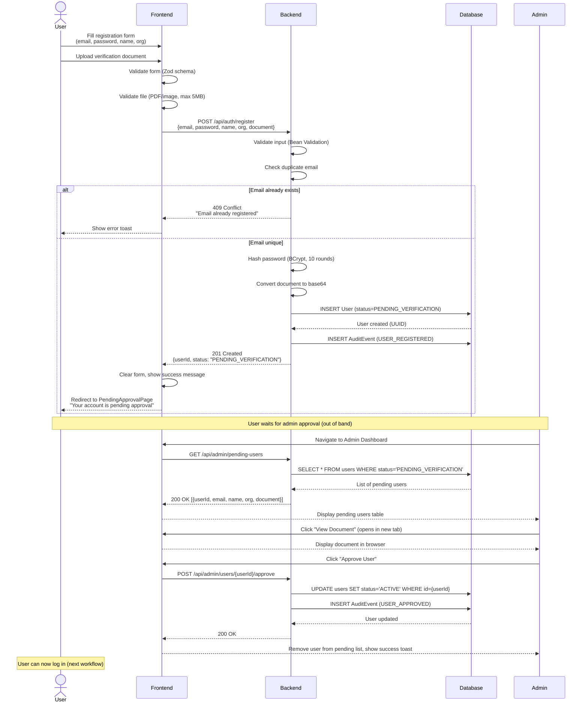
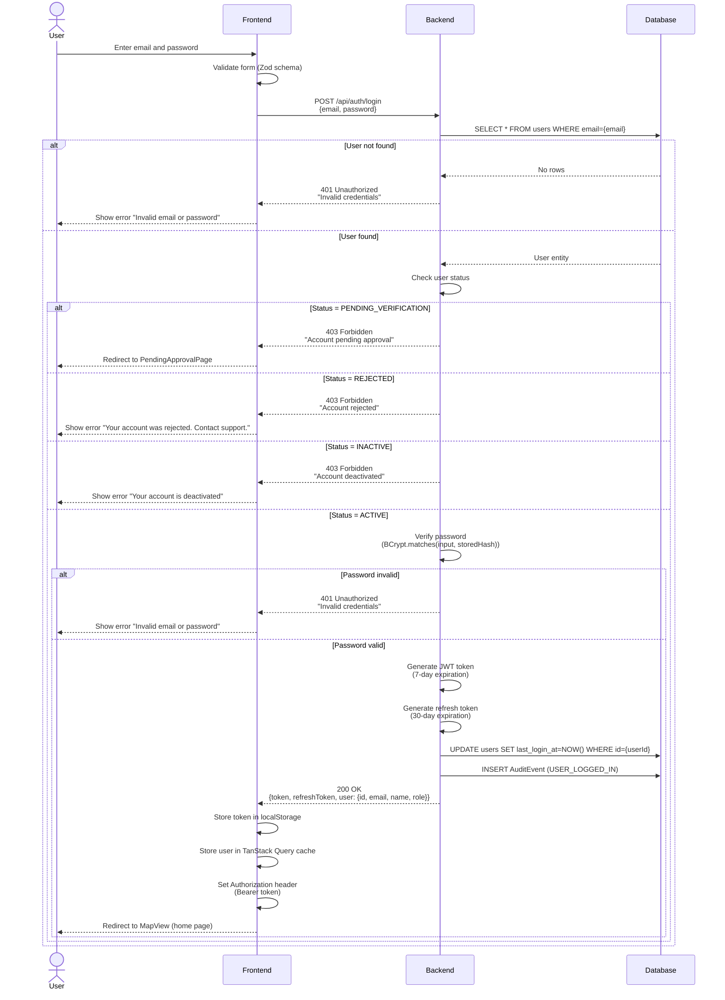
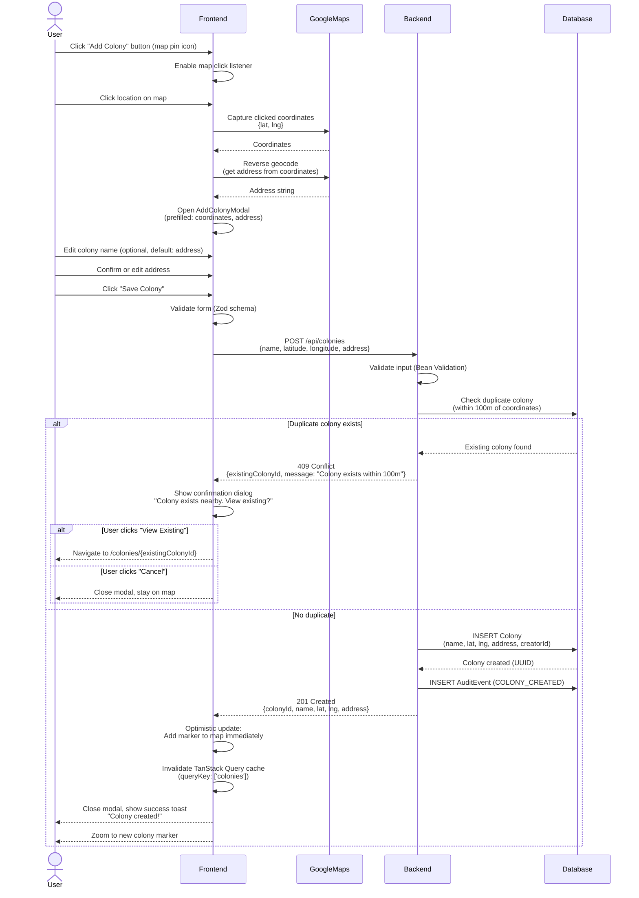
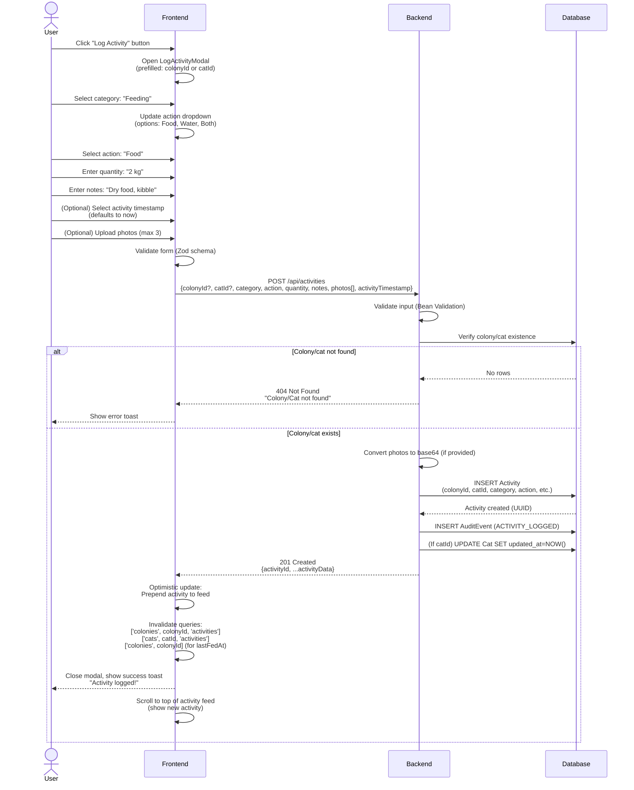
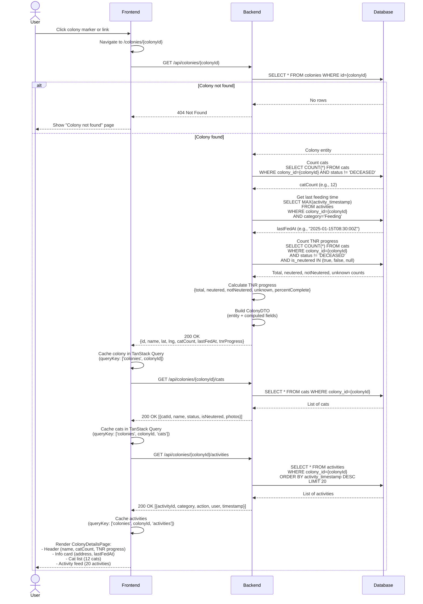

# Core Workflows

This section documents the key user workflows through the Paw Patrol platform, detailing the sequence of interactions between frontend components, backend services, database, and external APIs. Each workflow includes a sequence diagram, happy path steps, error scenarios, and performance considerations.

## Workflow 1: User Registration and Approval

**Actors:** New User, System, Admin

**Trigger:** User clicks "Register" on landing page

**Sequence Diagram:**



**Happy Path Steps:**

1. **User fills registration form:**
   - Email (validated: email format, required)
   - Password (validated: min 8 chars, required)
   - Full name (validated: required)
   - Organization (optional)
   - Verification document (validated: PDF or image, max 5MB)

2. **Frontend validation:**
   - Zod schema validation on form submit
   - File type check (PDF, PNG, JPG, JPEG)
   - File size check (max 5MB)
   - Show inline validation errors

3. **Backend registration processing:**
   - Bean Validation on `RegisterRequest` DTO
   - Check email uniqueness (query `UserRepository.findByEmail()`)
   - Hash password with BCrypt (10 rounds)
   - Convert document file to base64 string (stored in JSONB)
   - Create User entity (status=`PENDING_VERIFICATION`, role=`USER`)
   - Save to database
   - Create audit event (`USER_REGISTERED`)

4. **User sees pending approval page:**
   - Message: "Your account is being reviewed by our team. You'll receive an email when approved."
   - Cannot log in until approved

5. **Admin reviews user:**
   - Navigate to Admin Dashboard
   - See list of pending users (name, email, org, uploaded document)
   - Click "View Document" to open in new tab
   - Verify document legitimacy (ID, organization proof, etc.)

6. **Admin approves user:**
   - Click "Approve User" button
   - Backend updates `status` to `ACTIVE`
   - User can now log in

**Error Scenarios:**

| Error | Cause | Handling |
|-------|-------|----------|
| Email already registered | User tries duplicate email | 409 Conflict, frontend shows "Email already registered. Try logging in." |
| Weak password | Password < 8 chars | 400 Bad Request, frontend shows inline validation error |
| Document too large | File > 5MB | Frontend blocks upload, shows "File must be under 5MB" |
| Invalid document type | File not PDF/image | Frontend blocks upload, shows "Only PDF and images allowed" |
| Network failure during registration | Connection lost | Frontend shows retry button, "Registration failed. Try again." |
| Database constraint violation | Rare: UUID collision | 500 Internal Server Error, frontend shows generic error |

**Performance Considerations:**

- **Password hashing:** BCrypt with 10 rounds takes ~100-200ms on server (acceptable for registration)
- **Document upload:** 5MB max → ~5-10 seconds on slow connection (show progress bar)
- **Database write:** User + AuditEvent inserts ~10-20ms
- **Total registration time:** ~5-15 seconds (dominated by file upload)

**PRD Reference:** FR1, FR2, FR3, FR6

---

## Workflow 2: User Login

**Actors:** User, System

**Trigger:** User clicks "Login" on landing page

**Sequence Diagram:**



**Happy Path Steps:**

1. **User enters credentials:**
   - Email (validated: email format, required)
   - Password (validated: required)

2. **Frontend validation:**
   - Zod schema validation on form submit
   - Show inline validation errors

3. **Backend authentication:**
   - Query user by email (`UserRepository.findByEmail()`)
   - Check user status (must be `ACTIVE`)
   - Verify password (`PasswordEncoder.matches()` with BCrypt hash)
   - Generate JWT token (7-day expiration, includes userId, email, role)
   - Generate refresh token (30-day expiration)
   - Update `lastLoginAt` timestamp
   - Create audit event (`USER_LOGGED_IN`)

4. **Frontend session management:**
   - Store JWT token in `localStorage` (key: `authToken`)
   - Store refresh token in `localStorage` (key: `refreshToken`)
   - Store user object in TanStack Query cache (queryKey: `['user']`)
   - Set Axios default header: `Authorization: Bearer ${token}`
   - Redirect to `/` (MapView)

5. **User sees home page:**
   - MapView loads with colonies
   - Header shows user name and logout button

**Error Scenarios:**

| Error | Cause | Handling |
|-------|-------|----------|
| Invalid email/password | Wrong credentials | 401 Unauthorized, show "Invalid email or password" (same message for both to prevent user enumeration) |
| Account pending approval | Status = PENDING_VERIFICATION | 403 Forbidden, redirect to PendingApprovalPage |
| Account rejected | Status = REJECTED | 403 Forbidden, show "Account rejected. Contact support." |
| Account deactivated | Status = INACTIVE | 403 Forbidden, show "Account deactivated" |
| Network failure | Connection lost | Frontend shows retry button, "Login failed. Check your connection." |
| Token generation failure | Rare: JWT library error | 500 Internal Server Error, frontend shows generic error |

**Performance Considerations:**

- **Password verification:** BCrypt.matches() takes ~100-200ms (acceptable for login)
- **Database query:** User lookup by email (indexed) ~5-10ms
- **JWT generation:** ~5-10ms
- **Total login time:** ~200-300ms (dominated by BCrypt)

**Security Notes:**

- Password sent over HTTPS only (plain text in transit, but encrypted at transport layer)
- Same error message for "user not found" and "wrong password" (prevents user enumeration)
- Rate limiting: Max 5 login attempts per email per 15 minutes (prevents brute force)
- JWT signed with HS512 algorithm (secret key in environment variable)

**PRD Reference:** FR4, FR5

---

## Workflow 3: Adding a New Colony

**Actors:** User (authenticated), System, Google Maps API

**Trigger:** User clicks map pin icon → clicks map location → fills colony form

**Sequence Diagram:**



**Happy Path Steps:**

1. **User initiates colony creation:**
   - Click "Add Colony" button (floating action button with pin icon)
   - Map enters "add mode" (cursor changes to crosshair)

2. **User selects location:**
   - Click any location on map
   - Frontend captures `{lat, lng}` coordinates

3. **Frontend reverse geocodes:**
   - Call Google Maps Geocoding API (reverse geocode)
   - Get human-readable address from coordinates
   - Prefill form with address (user can edit)

4. **User fills colony form:**
   - Colony name (optional, defaults to address)
   - Address (prefilled, editable)
   - Coordinates (readonly, from map click)

5. **Frontend submits colony:**
   - Validate form with Zod schema
   - POST to `/api/colonies`
   - Optimistically add marker to map (TanStack Query `onMutate`)

6. **Backend processes colony creation:**
   - Validate input (Bean Validation)
   - Check for duplicate colony within 100m (Haversine distance formula)
   - If unique, insert Colony entity
   - Create audit event (`COLONY_CREATED`)
   - Return 201 Created with colony DTO

7. **Frontend updates UI:**
   - If success: Show marker on map, invalidate colonies cache, show toast
   - If duplicate: Show confirmation dialog with option to view existing colony

**Duplicate Detection Logic (Backend):**

```java
@Service
public class ColonyService {
    
    private static final double DUPLICATE_THRESHOLD_METERS = 100.0;
    
    public ColonyDTO createColony(CreateColonyRequest request, UUID creatorId) {
        // Check for duplicate within 100m
        List<Colony> nearbyColonies = colonyRepository.findNearbyColonies(
            request.getLatitude(),
            request.getLongitude(),
            DUPLICATE_THRESHOLD_METERS
        );
        
        if (!nearbyColonies.isEmpty()) {
            Colony existing = nearbyColonies.get(0);
            throw new DuplicateResourceException(
                "Colony exists within 100m",
                existing.getId()
            );
        }
        
        // Create colony
        Colony colony = Colony.builder()
            .name(request.getName())
            .latitude(request.getLatitude())
            .longitude(request.getLongitude())
            .address(request.getAddress())
            .creator(userRepository.getReferenceById(creatorId))
            .build();
        
        Colony saved = colonyRepository.save(colony);
        auditService.logEvent(AuditEventType.COLONY_CREATED, creatorId, saved.getId(), null);
        
        return ColonyDTO.fromEntity(saved, 0, null, TnrProgress.NOT_STARTED);
    }
}
```

**Haversine Distance Query (PostgreSQL):**

```sql
-- Custom repository method using native SQL
@Query(value = """
    SELECT * FROM colonies
    WHERE (
        6371000 * acos(
            cos(radians(:latitude)) * cos(radians(latitude)) *
            cos(radians(longitude) - radians(:longitude)) +
            sin(radians(:latitude)) * sin(radians(latitude))
        )
    ) < :radiusMeters
    ORDER BY (
        6371000 * acos(
            cos(radians(:latitude)) * cos(radians(latitude)) *
            cos(radians(longitude) - radians(:longitude)) +
            sin(radians(:latitude)) * sin(radians(latitude))
        )
    )
    """, nativeQuery = true)
List<Colony> findNearbyColonies(
    @Param("latitude") BigDecimal latitude,
    @Param("longitude") BigDecimal longitude,
    @Param("radiusMeters") double radiusMeters
);
```

**Error Scenarios:**

| Error | Cause | Handling |
|-------|-------|----------|
| Duplicate colony (within 100m) | Colony already exists nearby | 409 Conflict with `existingColonyId`, frontend shows confirmation dialog |
| Invalid coordinates | Lat/lng out of range | 400 Bad Request, frontend shows "Invalid location" |
| Geocoding API failure | Google Maps API down | Use coordinates as address fallback, allow user to enter address manually |
| Network failure during creation | Connection lost | Frontend rolls back optimistic update (TanStack Query `onError`), shows retry button |
| Unauthorized | JWT expired | 401 Unauthorized, redirect to login |

**Performance Considerations:**

- **Reverse geocoding:** ~200-500ms (Google Maps API call)
- **Duplicate detection:** ~20-50ms (Haversine formula with indexed lat/lng)
- **Database insert:** ~10-20ms
- **Total creation time:** ~250-600ms (dominated by geocoding)

**Optimistic UI Updates:**

```typescript
const createColonyMutation = useMutation({
  mutationFn: (data: CreateColonyRequest) => colonyService.createColony(data),
  onMutate: async (newColony) => {
    // Cancel outgoing refetches
    await queryClient.cancelQueries({ queryKey: ['colonies'] });
    
    // Snapshot previous value
    const previousColonies = queryClient.getQueryData<Colony[]>(['colonies']);
    
    // Optimistically update (add marker to map)
    queryClient.setQueryData<Colony[]>(['colonies'], (old) => [
      ...old,
      { ...newColony, id: 'temp-' + Date.now() }, // Temporary ID
    ]);
    
    return { previousColonies }; // Context for rollback
  },
  onError: (err, newColony, context) => {
    // Rollback on error
    queryClient.setQueryData(['colonies'], context.previousColonies);
    toast.error('Failed to create colony. Try again.');
  },
  onSettled: () => {
    // Refetch to get accurate server state
    queryClient.invalidateQueries({ queryKey: ['colonies'] });
  },
});
```

**PRD Reference:** FR7, FR8, FR9, FR10, FR11, FR21, FR24

---

## Workflow 4: Logging a Feeding Activity

**Actors:** User (authenticated), System

**Trigger:** User clicks "Log Activity" button on ColonyDetailsPage or CatProfilePage

**Sequence Diagram:**



**Happy Path Steps:**

1. **User initiates activity logging:**
   - Click "Log Activity" button (floating action button on colony/cat page)
   - Modal opens with context (colonyId or catId prefilled)

2. **User fills activity form (step 1: Category):**
   - Select category from dropdown (Feeding, Health, Environment, Other)
   - Action dropdown updates based on category selection

3. **User fills activity form (step 2: Action & Details):**
   - **Category: Feeding** → Actions: Food, Water, Both
   - Enter quantity (free text, e.g., "2 kg", "5 bowls")
   - Enter notes (optional, e.g., "Dry food, kibble brand X")
   - Select activity timestamp (defaults to current time, can backdate)
   - Upload photos (optional, max 3, each max 2MB)

4. **Frontend validates and submits:**
   - Validate form with Zod schema (category, action required)
   - Resize photos client-side (max 1920px width, ~200KB each)
   - POST to `/api/activities`
   - Optimistically prepend activity to feed (TanStack Query `onMutate`)

5. **Backend processes activity:**
   - Validate input (Bean Validation)
   - Verify colony/cat exists
   - Convert photos to base64 (store in JSONB `photos` array)
   - Insert Activity entity (immutable for MVP)
   - Create audit event (`ACTIVITY_LOGGED`)
   - If cat-specific activity, touch Cat's `updatedAt` timestamp

6. **Frontend updates UI:**
   - Prepend new activity to feed
   - Update colony's `lastFedAt` (invalidate colony cache)
   - Show success toast
   - Scroll to top of feed to show new activity

**Action Dropdowns by Category:**

```typescript
const ACTION_OPTIONS = {
  Feeding: ['Food', 'Water', 'Both'],
  Health: ['Vaccination', 'Deworming', 'Injury Treatment', 'Vet Visit', 'Medication'],
  Environment: ['Shelter Setup', 'Cleaning', 'Hazard Removal'],
  Other: ['Observation', 'TNR', 'Adoption', 'Other'],
};
```

**Example Activity Form Data:**

```json
{
  "colonyId": "123e4567-e89b-12d3-a456-426614174000",
  "catId": null,
  "category": "Feeding",
  "action": "Food",
  "quantity": "2 kg",
  "notes": "Dry food (kibble), Brand: Whiskas",
  "activityTimestamp": "2025-01-15T08:30:00Z",
  "photos": [
    "data:image/jpeg;base64,/9j/4AAQSkZJRg...",
    "data:image/jpeg;base64,/9j/4AAQSkZJRg..."
  ]
}
```

**Error Scenarios:**

| Error | Cause | Handling |
|-------|-------|----------|
| Colony/cat not found | Invalid ID | 404 Not Found, show "Colony/Cat not found" toast |
| Missing required fields | Category or action empty | 400 Bad Request, show inline validation errors |
| Too many photos | > 3 photos uploaded | Frontend blocks upload, shows "Max 3 photos allowed" |
| Photo too large | Photo > 2MB (after resize) | Frontend shows "Photo too large, try another" |
| Network failure | Connection lost | Frontend rolls back optimistic update, shows retry button |
| Unauthorized | JWT expired | 401 Unauthorized, redirect to login |

**Performance Considerations:**

- **Photo resize (client-side):** ~500ms per photo (3 photos = 1.5s)
- **Photo base64 encoding:** ~100ms per photo
- **Database insert:** ~10-20ms
- **Total logging time:** ~2-3 seconds (dominated by photo processing)

**Optimistic UI Update:**

```typescript
const logActivityMutation = useMutation({
  mutationFn: (data: LogActivityRequest) => activityService.logActivity(data),
  onMutate: async (newActivity) => {
    await queryClient.cancelQueries({ queryKey: ['activities'] });
    
    const previousActivities = queryClient.getQueryData<Activity[]>([
      'colonies', newActivity.colonyId, 'activities'
    ]);
    
    // Optimistically add activity to feed
    queryClient.setQueryData<Activity[]>(
      ['colonies', newActivity.colonyId, 'activities'],
      (old) => [
        { ...newActivity, id: 'temp-' + Date.now(), createdAt: new Date().toISOString() },
        ...old,
      ]
    );
    
    return { previousActivities };
  },
  onError: (err, newActivity, context) => {
    queryClient.setQueryData(
      ['colonies', newActivity.colonyId, 'activities'],
      context.previousActivities
    );
    toast.error('Failed to log activity. Try again.');
  },
  onSettled: (data, err, variables) => {
    queryClient.invalidateQueries({ queryKey: ['activities'] });
    queryClient.invalidateQueries({ queryKey: ['colonies', variables.colonyId] }); // Update lastFedAt
  },
});
```

**PRD Reference:** FR36, FR38, FR39, FR40, FR41, FR48, FR51

---

## Workflow 5: Viewing Colony Details with Computed Fields

**Actors:** User (authenticated), System

**Trigger:** User clicks colony marker on map or colony link

**Sequence Diagram:**



**Happy Path Steps:**

1. **User navigates to colony:**
   - Click colony marker on map
   - Or click colony link from search results
   - Frontend navigates to `/colonies/{colonyId}` (React Router)

2. **Frontend fetches colony data:**
   - GET `/api/colonies/{colonyId}`
   - TanStack Query caches response (5 minutes stale time)

3. **Backend calculates computed fields:**
   - **catCount:** Query `CatRepository.countByColonyIdAndStatusNot(colonyId, DECEASED)`
   - **lastFedAt:** Query `ActivityRepository.findLastFeedingTime(colonyId)` (MAX activity_timestamp WHERE category='Feeding')
   - **tnrProgress:** Query multiple counts:
     - Total cats (status != DECEASED)
     - Neutered cats (isNeutered = true)
     - Not neutered cats (isNeutered = false)
     - Unknown status cats (isNeutered = null)
     - Calculate `percentComplete = (neutered / total) * 100`

4. **Backend returns ColonyDTO:**
   - Entity fields: id, name, latitude, longitude, address, creatorId, createdAt, updatedAt
   - Computed fields: catCount, lastFedAt, tnrProgress

5. **Frontend fetches related data (parallel):**
   - GET `/api/colonies/{colonyId}/cats` (list of cats with thumbnails)
   - GET `/api/colonies/{colonyId}/activities?limit=20` (recent activities)

6. **Frontend renders ColonyDetailsPage:**
   - **Header section:**
     - Colony name (editable on hover)
     - Cat count badge ("12 cats")
     - TNR progress bar (e.g., "8/12 neutered (67%)")
   - **Info card:**
     - Address with map link
     - Last fed status (e.g., "Fed 2 hours ago" or "Last fed 3 days ago")
     - Creator info (name, joined date)
   - **Cat list:**
     - Grid of cat cards (photo thumbnail, name, status chip)
     - Click to navigate to cat profile
   - **Activity feed:**
     - List of recent activities (reverse chronological)
     - User avatar, action description, timestamp
     - "Load More" button (pagination)

**Custom Repository Queries:**

```java
@Repository
public interface ActivityRepository extends JpaRepository<Activity, UUID> {
    
    @Query("""
        SELECT a.activityTimestamp
        FROM Activity a
        WHERE a.colony.id = :colonyId
        AND a.category = 'FEEDING'
        ORDER BY a.activityTimestamp DESC
        LIMIT 1
        """)
    Optional<Instant> findLastFeedingTime(@Param("colonyId") UUID colonyId);
    
    @Query("""
        SELECT a FROM Activity a
        LEFT JOIN FETCH a.user
        WHERE a.colony.id = :colonyId
        ORDER BY a.activityTimestamp DESC
        """)
    Page<Activity> findByColonyId(@Param("colonyId") UUID colonyId, Pageable pageable);
}
```

**TNR Progress Calculation:**

```java
public TnrProgress calculateTnrProgress(UUID colonyId) {
    int total = catRepository.countByColonyIdAndStatusNot(colonyId, CatStatus.DECEASED);
    int neutered = catRepository.countByColonyIdAndIsNeutered(colonyId, true);
    int notNeutered = catRepository.countByColonyIdAndIsNeutered(colonyId, false);
    int unknown = catRepository.countByColonyIdAndIsNeuteredIsNull(colonyId);
    
    double percentComplete = total > 0 ? (neutered * 100.0 / total) : 0.0;
    
    return TnrProgress.builder()
        .total(total)
        .neutered(neutered)
        .notNeutered(notNeutered)
        .unknown(unknown)
        .percentComplete(Math.round(percentComplete * 10) / 10.0) // Round to 1 decimal
        .build();
}
```

**Frontend "Last Fed" Display Logic:**

```typescript
function formatLastFed(lastFedAt: string | null): string {
  if (!lastFedAt) return 'Never fed';
  
  const now = new Date();
  const fed = new Date(lastFedAt);
  const diffMs = now.getTime() - fed.getTime();
  const diffHours = Math.floor(diffMs / (1000 * 60 * 60));
  const diffDays = Math.floor(diffHours / 24);
  
  if (diffHours < 1) return 'Fed less than 1 hour ago';
  if (diffHours < 24) return `Fed ${diffHours} hours ago`;
  if (diffDays < 7) return `Last fed ${diffDays} days ago`;
  
  return `Last fed on ${fed.toLocaleDateString()}`;
}
```

**Performance Considerations:**

- **Colony query:** ~5-10ms (single row by primary key)
- **Computed field queries (parallel):**
  - catCount: ~10ms (indexed colony_id)
  - lastFedAt: ~15ms (indexed colony_id + category, DESC order)
  - TNR progress (3 queries): ~30ms total
- **Total backend time:** ~60-80ms (dominated by TNR progress queries)
- **Frontend rendering:** ~100-200ms (depends on cat/activity count)
- **Total page load:** ~200-300ms (acceptable for detail page)

**Caching Strategy:**

```typescript
// TanStack Query configuration for colony details
export const useColony = (colonyId: string) => {
  return useQuery({
    queryKey: ['colonies', colonyId],
    queryFn: () => colonyService.getColony(colonyId),
    staleTime: 5 * 60 * 1000, // 5 minutes
    gcTime: 10 * 60 * 1000, // 10 minutes (formerly cacheTime)
  });
};
```

**PRD Reference:** FR29, FR30, FR42, FR52, FR53

---

## Workflow 6: Admin User Approval

**(See Workflow 1 for complete sequence diagram)**

**Summary:** Admin reviews pending users, views verification documents, and approves/rejects accounts.

**Key Steps:**
1. Admin navigates to Admin Dashboard
2. System loads pending users (status=`PENDING_VERIFICATION`)
3. Admin clicks "View Document" to review legitimacy
4. Admin clicks "Approve" or "Reject" with optional reason
5. System updates user status to `ACTIVE` or `REJECTED`
6. System creates audit event (`USER_APPROVED` or `USER_REJECTED`)
7. User receives email notification (future: email service integration)

**PRD Reference:** FR2, FR6

---

## Workflow Summary Table

| Workflow | Actors | Primary Entities | Key Technologies | Performance Target |
|----------|--------|------------------|-----------------|-------------------|
| 1. User Registration | User, Admin | User, AuditEvent | BCrypt, JSONB (document) | ~5-15 seconds (file upload) |
| 2. User Login | User | User, AuditEvent | BCrypt, JWT | ~200-300ms |
| 3. Add Colony | User, Google Maps | Colony, AuditEvent | Google Geocoding, Haversine | ~250-600ms |
| 4. Log Activity | User | Activity, AuditEvent | JSONB (photos) | ~2-3 seconds (photo processing) |
| 5. View Colony Details | User | Colony, Cat, Activity | Computed fields (COUNT, MAX) | ~200-300ms |
| 6. Admin Approval | Admin | User, AuditEvent | - | ~100ms |

---
