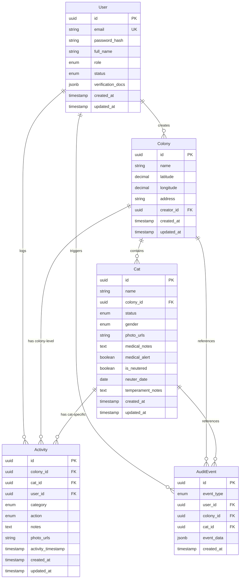

# Data Models

This section defines the core domain entities for the Paw Patrol system. Each entity is specified with both TypeScript interfaces (for the `shared/` package) and JPA entity specifications (for the backend). All timestamps use ISO 8601 format (UTC) and are converted to Philippines timezone (GMT+8) for display.

## Core Entities Overview

The system models five primary entities: **User**, **Colony**, **Cat**, **Activity**, and **AuditEvent**. These form the backbone of the data model:

- **User:** Represents rescue volunteers with authentication and role-based access
- **Colony:** Geographic locations where cat communities are tracked (1 colony : N cats)
- **Cat:** Individual cats with health, TNR, and behavioral data (N cats : 1 colony)
- **Activity:** Time-stamped event logs for feeding, health, environment actions (N activities : 1 cat or 1 colony)
- **AuditEvent:** System-generated audit trail for data modifications (N audit events : 1 user/colony/cat)

## Entity Relationship Diagram



---

## 1. User Entity

**Purpose:** Stores rescue volunteer accounts with authentication credentials and verification status.

**TypeScript Interface** (`shared/src/types/User.ts`):
```typescript
export enum UserRole {
  REGULAR_USER = 'REGULAR_USER',
  ADMIN = 'ADMIN',
  SUPER_ADMIN = 'SUPER_ADMIN'
}

export enum UserStatus {
  PENDING_APPROVAL = 'PENDING_APPROVAL',
  APPROVED = 'APPROVED',
  REJECTED = 'REJECTED',
  SUSPENDED = 'SUSPENDED'
}

export interface VerificationDocument {
  filename: string;
  url: string;
  uploadedAt: string; // ISO 8601
}

export interface User {
  id: string; // UUID
  email: string;
  fullName: string;
  role: UserRole;
  status: UserStatus;
  verificationDocs: VerificationDocument[];
  createdAt: string; // ISO 8601
  updatedAt: string; // ISO 8601
}

// DTO for user registration (includes plain-text password)
export interface UserRegistrationRequest {
  email: string;
  password: string; // Plain-text, will be hashed by backend
  fullName: string;
  verificationDocs: File[]; // Uploaded files
}

// Password is NEVER included in User response from API
// Password hashing occurs in backend service layer using BCrypt before database storage
```

**JPA Entity Specification** (`backend/src/main/java/com/pawpatrol/entity/User.java`):
```java
@Entity
@Table(name = "users")
public class User {
    @Id
    @GeneratedValue(strategy = GenerationType.UUID)
    private UUID id;
    
    @Column(nullable = false, unique = true, length = 255)
    private String email;
    
    @Column(nullable = false, length = 255)
    private String passwordHash; // BCrypt hashed, never exposed via API
    
    @Column(nullable = false, length = 255)
    private String fullName;
    
    @Enumerated(EnumType.STRING)
    @Column(nullable = false, length = 50)
    private UserRole role = UserRole.REGULAR_USER;
    
    @Enumerated(EnumType.STRING)
    @Column(nullable = false, length = 50)
    private UserStatus status = UserStatus.PENDING_APPROVAL;
    
    @Type(JsonBinaryType.class) // Hibernate 6 JSON support
    @Column(columnDefinition = "jsonb")
    private List<VerificationDocument> verificationDocs;
    
    @Column(nullable = false, updatable = false)
    private Instant createdAt;
    
    @Column(nullable = false)
    private Instant updatedAt;
    
    @OneToMany(mappedBy = "creator")
    private List<Colony> colonies;
    
    @OneToMany(mappedBy = "user")
    private List<Activity> activities;
    
    @PrePersist
    protected void onCreate() {
        createdAt = updatedAt = Instant.now();
    }
    
    @PreUpdate
    protected void onUpdate() {
        updatedAt = Instant.now();
    }
}
```

**Design Decisions:**
- **UUID Primary Keys:** Prevents enumeration attacks, better for distributed systems
- **BCrypt Password Hashing (Backend Only):** 
  - Frontend sends plain-text password over HTTPS to `/api/auth/register` endpoint
  - Backend UserService uses Spring Security's `PasswordEncoder.encode(plainPassword)` before saving
  - BCrypt algorithm with automatic salt generation (10 rounds default)
  - `passwordHash` stored in database, plain password never persisted
  - Login: Backend compares submitted password with stored hash using `PasswordEncoder.matches()`
  - **Security:** Plain password only exists in memory during request processing, never logged or stored
- **Enum Role/Status:** Type-safe, prevents invalid values, easy to extend
- **JSONB for Verification Docs:** Flexible schema for document metadata (filenames, URLs, timestamps)
- **Email Uniqueness:** Enforced at database level for data integrity
- **Password Never in API Response:** `passwordHash` field excluded from User DTO (via `@JsonIgnore` or DTO mapping)

---

## 2. Colony Entity

**Purpose:** Represents geographic locations where cat communities are tracked.

**TypeScript Interface** (`shared/src/types/Colony.ts`):
```typescript
export interface ColonyCoordinates {
  latitude: number;  // Decimal degrees, 6 decimal places precision (~0.1m)
  longitude: number; // Decimal degrees, 6 decimal places precision
}

export interface Colony {
  id: string; // UUID
  name: string;
  latitude: number;
  longitude: number;
  address: string | null; // Optional, reverse-geocoded from coordinates
  creatorId: string; // UUID of User who created colony
  
  // Computed fields (calculated in backend service layer, not stored in DB):
  catCount: number; // COUNT(cats) WHERE colony_id = ? AND status != 'DECEASED'
  lastFedAt: string | null; // ISO 8601, MAX(activity_timestamp) WHERE category = 'FEEDING'
  tnrProgress: {
    neutered: number;   // COUNT(cats) WHERE is_neutered = true
    total: number;      // COUNT(cats) WHERE status != 'DECEASED'
  };
  
  createdAt: string; // ISO 8601
  updatedAt: string; // ISO 8601
}
```

**JPA Entity Specification** (`backend/src/main/java/com/pawpatrol/entity/Colony.java`):
```java
@Entity
@Table(name = "colonies", indexes = {
    @Index(name = "idx_colony_coordinates", columnList = "latitude, longitude")
})
public class Colony {
    @Id
    @GeneratedValue(strategy = GenerationType.UUID)
    private UUID id;
    
    @Column(nullable = false, length = 255)
    private String name;
    
    @Column(nullable = false, precision = 9, scale = 6)
    private BigDecimal latitude; // Range: -90 to +90, 6 decimal places
    
    @Column(nullable = false, precision = 9, scale = 6)
    private BigDecimal longitude; // Range: -180 to +180, 6 decimal places
    
    @Column(length = 500)
    private String address; // Optional, from Google Geocoding API
    
    @ManyToOne(fetch = FetchType.LAZY)
    @JoinColumn(name = "creator_id", nullable = false)
    private User creator;
    
    @Column(nullable = false, updatable = false)
    private Instant createdAt;
    
    @Column(nullable = false)
    private Instant updatedAt;
    
    @OneToMany(mappedBy = "colony", cascade = CascadeType.ALL)
    private List<Cat> cats = new ArrayList<>();
    
    @OneToMany(mappedBy = "colony")
    private List<Activity> activities = new ArrayList<>();
    
    @PrePersist
    protected void onCreate() {
        createdAt = updatedAt = Instant.now();
    }
    
    @PreUpdate
    protected void onUpdate() {
        updatedAt = Instant.now();
    }
}
```

**Design Decisions:**
- **BigDecimal for Coordinates:** Prevents floating-point precision errors in distance calculations
- **6 Decimal Places:** Provides ~0.1 meter precision (sufficient for duplicate detection, FR24)
- **Composite Index:** Optimizes geospatial queries (nearby colonies, search by location)
- **Lazy Loading:** User creator loaded only when accessed (prevents N+1 queries)
- **Computed Fields (Backend Service Layer):** 
  - `catCount`: Calculated via `@Query("SELECT COUNT(c) FROM Cat c WHERE c.colony.id = :colonyId AND c.status != 'DECEASED'")`
  - `lastFedAt`: Calculated via `@Query("SELECT MAX(a.activityTimestamp) FROM Activity a WHERE a.colony.id = :colonyId AND a.category = 'FEEDING'")`
  - `tnrProgress`: Calculated via two queries counting neutered vs total cats
  - These are computed on-demand when Colony DTO is returned by REST API (not stored in database)
  - **Why backend?** Ensures data consistency, reduces frontend complexity, single source of truth
- **Address Optional:** May be null if reverse geocoding fails or user provides coordinates only

---

## 3. Cat Entity

**Purpose:** Represents individual cats within colonies with health, TNR, and behavioral data.

**TypeScript Interface** (`shared/src/types/Cat.ts`):
```typescript
export enum CatStatus {
  ACTIVE = 'ACTIVE',
  ADOPTED = 'ADOPTED',
  RELOCATED = 'RELOCATED',
  MISSING = 'MISSING',
  DECEASED = 'DECEASED'
}

export enum CatGender {
  MALE = 'MALE',
  FEMALE = 'FEMALE',
  UNKNOWN = 'UNKNOWN'
}

export interface Cat {
  id: string; // UUID
  name: string;
  colonyId: string; // UUID
  status: CatStatus;
  gender: CatGender;
  photoUrls: string[]; // Max 10 photos (FR50)
  medicalNotes: string | null;
  medicalAlert: boolean; // Manually set flag (FR19, FR33)
  isNeutered: boolean | null; // null = unknown TNR status
  neuterDate: string | null; // ISO 8601 date (YYYY-MM-DD)
  temperamentNotes: string | null; // MVP: free-text (see MVP Scope Clarifications)
  createdAt: string; // ISO 8601
  updatedAt: string; // ISO 8601
}
```

**JPA Entity Specification** (`backend/src/main/java/com/pawpatrol/entity/Cat.java`):
```java
@Entity
@Table(name = "cats", indexes = {
    @Index(name = "idx_cat_colony", columnList = "colony_id"),
    @Index(name = "idx_cat_status", columnList = "status")
})
public class Cat {
    @Id
    @GeneratedValue(strategy = GenerationType.UUID)
    private UUID id;
    
    @Column(nullable = false, length = 255)
    private String name;
    
    @ManyToOne(fetch = FetchType.LAZY)
    @JoinColumn(name = "colony_id", nullable = false)
    private Colony colony;
    
    @Enumerated(EnumType.STRING)
    @Column(nullable = false, length = 50)
    private CatStatus status = CatStatus.ACTIVE;
    
    @Enumerated(EnumType.STRING)
    @Column(nullable = false, length = 50)
    private CatGender gender = CatGender.UNKNOWN;
    
    @Type(JsonBinaryType.class)
    @Column(columnDefinition = "jsonb")
    private List<String> photoUrls = new ArrayList<>(); // Max 10, validated in service layer
    
    @Column(columnDefinition = "TEXT")
    private String medicalNotes;
    
    @Column(nullable = false)
    private Boolean medicalAlert = false;
    
    @Column
    private Boolean isNeutered; // null = unknown, true = neutered, false = not neutered
    
    @Column
    private LocalDate neuterDate; // Date only, no time component
    
    @Column(columnDefinition = "TEXT")
    private String temperamentNotes; // MVP: free-text field
    
    @Column(nullable = false, updatable = false)
    private Instant createdAt;
    
    @Column(nullable = false)
    private Instant updatedAt;
    
    @OneToMany(mappedBy = "cat")
    private List<Activity> activities = new ArrayList<>();
    
    @PrePersist
    protected void onCreate() {
        createdAt = updatedAt = Instant.now();
    }
    
    @PreUpdate
    protected void onUpdate() {
        updatedAt = Instant.now();
    }
}
```

**Design Decisions:**
- **Status Enum Lifecycle:** ACTIVE → (ADOPTED | RELOCATED | MISSING | DECEASED)
- **Three-State Boolean for TNR:** null (unknown) vs false (not neutered) vs true (neutered) - supports FR53 logic
- **JSONB Photo Array:** Flexible for variable photo count, validated max 10 in service layer (FR50)
- **LocalDate for Neuter Date:** Date-only field (no time component needed for surgery dates)
- **Medical Alert Boolean:** Simple flag for quick filtering (FR19), details in `medicalNotes`
- **Temperament MVP:** Free-text for MVP, will migrate to enum tags post-MVP (see PRD MVP Scope Clarifications)
- **Colony Index:** Optimizes "get all cats in colony" queries (Colony Details page)
- **Status Index:** Optimizes filtering by status (FR18 - Active/Adopted/etc filters)

---

## 4. Activity Entity

**Purpose:** Time-stamped event logs for feeding, health, and environment actions.

**TypeScript Interface** (`shared/src/types/Activity.ts`):
```typescript
export enum ActivityCategory {
  FEEDING = 'FEEDING',
  HEALTH = 'HEALTH',
  ENVIRONMENT = 'ENVIRONMENT'
}

export enum FeedingAction {
  FED_WET_FOOD = 'FED_WET_FOOD',
  FED_DRY_FOOD = 'FED_DRY_FOOD',
  FED_TREATS = 'FED_TREATS',
  REFILLED_WATER = 'REFILLED_WATER'
}

export enum HealthAction {
  GAVE_MEDICATION = 'GAVE_MEDICATION',
  WOUND_TREATMENT = 'WOUND_TREATMENT',
  VET_VISIT = 'VET_VISIT',
  VACCINATION = 'VACCINATION',
  HEALTH_CHECK = 'HEALTH_CHECK',
  TRAPPED_FOR_TNR = 'TRAPPED_FOR_TNR',
  SPAY_NEUTER_SURGERY = 'SPAY_NEUTER_SURGERY'
}

export enum EnvironmentAction {
  CLEANED_AREA = 'CLEANED_AREA',
  REFILLED_WATER_STATION = 'REFILLED_WATER_STATION',
  SHELTER_MAINTENANCE = 'SHELTER_MAINTENANCE',
  WASTE_REMOVAL = 'WASTE_REMOVAL'
}

export type ActivityAction = FeedingAction | HealthAction | EnvironmentAction;

export interface Activity {
  id: string; // UUID
  colonyId: string; // UUID, always present (every activity belongs to a colony)
  catId: string | null; // UUID if cat-specific, null if colony-level
  userId: string; // UUID of user who logged activity
  category: ActivityCategory;
  action: ActivityAction;
  notes: string | null;
  photoUrls: string[]; // Max 3 photos (FR51)
  activityTimestamp: string; // ISO 8601, user-specified or auto-generated
  createdAt: string; // ISO 8601, when activity was logged
  updatedAt: string; // ISO 8601, MVP: immutable (see PRD MVP Scope)
}

// Activity Scope Logic:
// - Colony-level activity: catId = null, visible to entire colony
// - Cat-specific activity: catId = UUID, visible only on that cat's profile
// - Both types include colonyId for efficient querying
```

**JPA Entity Specification** (`backend/src/main/java/com/pawpatrol/entity/Activity.java`):
```java
@Entity
@Table(name = "activities", indexes = {
    @Index(name = "idx_activity_colony", columnList = "colony_id"),
    @Index(name = "idx_activity_cat", columnList = "cat_id"),
    @Index(name = "idx_activity_timestamp", columnList = "activity_timestamp")
})
public class Activity {
    @Id
    @GeneratedValue(strategy = GenerationType.UUID)
    private UUID id;
    
    @ManyToOne(fetch = FetchType.LAZY)
    @JoinColumn(name = "colony_id", nullable = false)
    private Colony colony; // Always present - every activity belongs to a colony
    
    @ManyToOne(fetch = FetchType.LAZY)
    @JoinColumn(name = "cat_id")
    private Cat cat; // Null for colony-level, UUID for cat-specific
    
    @ManyToOne(fetch = FetchType.LAZY)
    @JoinColumn(name = "user_id", nullable = false)
    private User user;
    
    @Enumerated(EnumType.STRING)
    @Column(nullable = false, length = 50)
    private ActivityCategory category;
    
    @Column(nullable = false, length = 100)
    private String action; // Stored as string to accommodate multiple action enums
    
    @Column(columnDefinition = "TEXT")
    private String notes;
    
    @Type(JsonBinaryType.class)
    @Column(columnDefinition = "jsonb")
    private List<String> photoUrls = new ArrayList<>(); // Max 3, validated in service layer
    
    @Column(nullable = false)
    private Instant activityTimestamp; // When activity occurred (user-specified or auto)
    
    @Column(nullable = false, updatable = false)
    private Instant createdAt; // When activity was logged in system
    
    @Column(nullable = false)
    private Instant updatedAt; // MVP: same as createdAt (immutable logs)
    
    @PrePersist
    protected void onCreate() {
        createdAt = updatedAt = Instant.now();
        if (activityTimestamp == null) {
            activityTimestamp = Instant.now(); // Default to current time
        }
    }
    
    // MVP: No @PreUpdate (logs are immutable)
    
    // Helper methods for activity scope
    public boolean isColonyLevel() {
        return cat == null;
    }
    
    public boolean isCatSpecific() {
        return cat != null;
    }
}
```

**Design Decisions:**
- **Colony Always Required:** Every activity belongs to a colony (nullable = false) - simplifies querying
- **Cat Determines Scope:** `catId = null` → colony-level, `catId != null` → cat-specific
- **Activity Visibility Logic:**
  - **Colony Details page (FR42):** Query `WHERE colony_id = ? ORDER BY activity_timestamp DESC` (returns both colony-level AND cat-specific activities)
  - **Cat Profile page (FR43):** Query `WHERE cat_id = ? ORDER BY activity_timestamp DESC` (returns only that cat's activities)
  - **Colony-level activities:** Created when user clicks "Log Activity" button on Colony Details page (catId left null)
  - **Cat-specific activities:** Created when user clicks "Log Activity" button on Cat Profile page (catId set to current cat)
- **Action as String:** Stores enum value as string to accommodate multiple action types (Feeding/Health/Environment)
- **Two Timestamps:** `activityTimestamp` (when event occurred) vs `createdAt` (when logged in system)
- **JSONB Photo Array:** Max 3 photos, validated in service layer (FR51)
- **MVP Immutability:** No `@PreUpdate` hook, logs cannot be edited (see PRD MVP Scope Clarifications)
- **Indexes:** Optimize queries for colony/cat activity logs and time-based filtering (FR48)
- **Helper Methods:** `isColonyLevel()` and `isCatSpecific()` for readable business logic

---

## 5. AuditEvent Entity

**Purpose:** System-generated audit trail for data modifications (FR47, NFR11).

**TypeScript Interface** (`shared/src/types/AuditEvent.ts`):
```typescript
export enum AuditEventType {
  COLONY_CREATED = 'COLONY_CREATED',
  COLONY_UPDATED = 'COLONY_UPDATED',
  COLONY_DELETED = 'COLONY_DELETED',
  CAT_ADDED = 'CAT_ADDED',
  CAT_PROFILE_EDITED = 'CAT_PROFILE_EDITED',
  CAT_STATUS_CHANGED = 'CAT_STATUS_CHANGED',
  ACTIVITY_LOG_CREATED = 'ACTIVITY_LOG_CREATED',
  ACTIVITY_LOG_EDITED = 'ACTIVITY_LOG_EDITED',
  USER_REGISTERED = 'USER_REGISTERED',
  USER_APPROVED = 'USER_APPROVED',
  USER_REJECTED = 'USER_REJECTED'
}

export interface AuditEvent {
  id: string; // UUID
  eventType: AuditEventType;
  userId: string; // UUID of user who triggered event
  colonyId: string | null; // UUID, null if not colony-related
  catId: string | null; // UUID, null if not cat-related
  eventData: Record<string, any>; // JSON payload with event-specific details
  createdAt: string; // ISO 8601
}
```

**JPA Entity Specification** (`backend/src/main/java/com/pawpatrol/entity/AuditEvent.java`):
```java
@Entity
@Table(name = "audit_events", indexes = {
    @Index(name = "idx_audit_user", columnList = "user_id"),
    @Index(name = "idx_audit_created", columnList = "created_at")
})
public class AuditEvent {
    @Id
    @GeneratedValue(strategy = GenerationType.UUID)
    private UUID id;
    
    @Enumerated(EnumType.STRING)
    @Column(nullable = false, length = 100)
    private AuditEventType eventType;
    
    @ManyToOne(fetch = FetchType.LAZY)
    @JoinColumn(name = "user_id", nullable = false)
    private User user;
    
    @Column
    private UUID colonyId; // Stored as UUID, not FK (allows orphan records for deleted colonies)
    
    @Column
    private UUID catId; // Stored as UUID, not FK (allows orphan records for deleted cats)
    
    @Type(JsonBinaryType.class)
    @Column(columnDefinition = "jsonb", nullable = false)
    private Map<String, Object> eventData; // Flexible event payload
    
    @Column(nullable = false, updatable = false)
    private Instant createdAt;
    
    @PrePersist
    protected void onCreate() {
        createdAt = Instant.now();
    }
}
```

**Design Decisions:**
- **Immutable Events:** No update/delete operations (audit trail integrity)
- **Denormalized IDs:** `colonyId`/`catId` stored as UUIDs (not FKs) to preserve audit records after entity deletion
- **JSONB Event Data:** Flexible schema for event-specific details (e.g., field changes, old/new values)
- **User FK Only:** User is only true FK (user accounts cannot be deleted, only suspended)
- **Created At Index:** Optimizes time-based audit log queries
- **Display Integration:** Audit events displayed inline with activity logs (FR47)

---

## Database Migrations

**Migration Strategy:**
- **Tool:** Flyway (Spring Boot integration)
- **Location:** `backend/src/main/resources/db/migration/`
- **Naming:** `V1__initial_schema.sql`, `V2__add_temperament_tags.sql`, etc.
- **Execution:** Automatic on application startup (Spring Boot auto-configuration)

**Initial Migration Considerations:**
- Create all tables with UUIDs as primary keys (use `gen_random_uuid()` for PostgreSQL)
- Create indexes for foreign keys and frequently queried columns
- Create UNIQUE constraint on `users.email`
- Create CHECK constraint for `colonies.latitude` (-90 to +90) and `longitude` (-180 to +180)
- Create CHECK constraint for Activity polymorphic association (`colony_id IS NOT NULL OR cat_id IS NOT NULL`)
- Enable `pgcrypto` extension for UUID generation: `CREATE EXTENSION IF NOT EXISTS "pgcrypto";`

---
