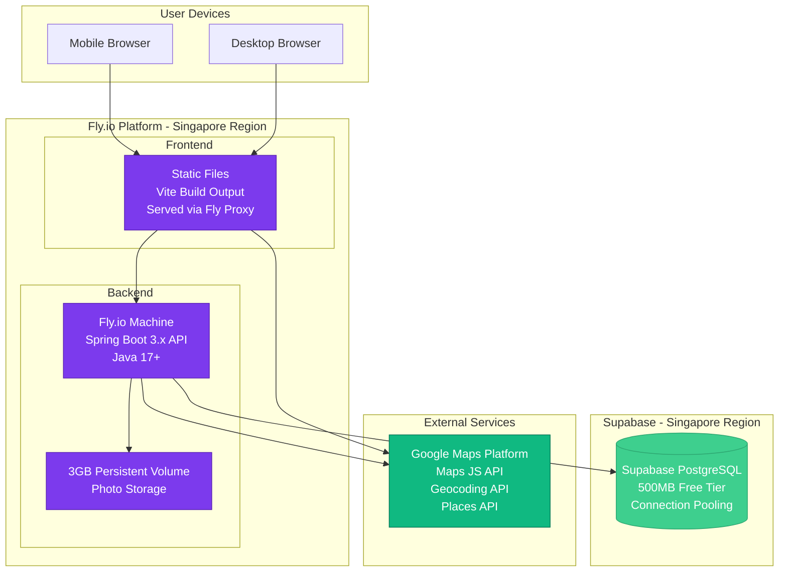

# High Level Architecture

## Technical Summary

Paw Patrol employs a **monolithic backend architecture with SPA frontend** deployed on Render's platform. The Spring Boot backend exposes a RESTful API consumed by a React single-page application, with PostgreSQL providing persistent storage and Google Maps Platform handling geospatial visualization.

The architecture prioritizes **rapid MVP delivery** over premature optimization, using proven patterns: traditional REST APIs, monolithic backend (not microservices), and **local file storage for initial MVP** (migrating to cloud storage post-validation). The React frontend uses React Query for server state management and React Router for navigation, with Tailwind CSS and Untitled UI providing a mobile-first component library.

Key integration points include: JWT-based authentication between frontend and backend, Google Maps JavaScript API for map rendering, and Geocoding API for address-to-coordinate conversion. The system is designed for **Philippines-scoped deployment** with hard geographic restrictions and timezone handling (GMT+8).

This architecture achieves PRD goals by optimizing for field use (mobile-first, fast map loading <3s), trust (manual verification workflow, audit logging), and rapid iteration (monorepo structure, straightforward deployment pipeline).

---

## Platform and Infrastructure Choice

Based on PRD requirements for rapid prototype deployment with **100% free tier** and need for **persistent photo storage**, I recommend:

**Recommended Platform: Fly.io + Supabase** ⭐

**Rationale:**
- **Superior free tier:** 3 shared-cpu VMs (2,340 GB-hours/month) vs alternatives' 750 hours
- **Hosts both frontend and backend:** Single platform, simpler deployment
- **Persistent storage included:** 3GB free persistent volumes - solves photo storage problem
- **No database time limits:** Supabase PostgreSQL free tier has no expiration
- **Better performance:** Fly.io machines closer to metal, faster cold starts
- **Global deployment:** Can deploy to Singapore region for Philippines latency
- **HTTPS by default** - Security requirement (NFR6) met automatically
- **Docker-based:** Standard containerization (requires simple Dockerfile)

**Fly.io Services:**
- **Backend:** Spring Boot app as Fly Machine (Java 17)
- **Frontend:** Vite-built static files served via Fly proxy
- 3 shared-cpu VMs (256MB RAM each)
- 2,340 GB-hours/month free (enough for 24/7 operation)
- 3GB persistent volume for photo storage (persistent across deploys!)
- 160GB outbound data transfer/month

**Supabase Database:**
- 500MB PostgreSQL database (sufficient for 50-100 colonies)
- 50,000 monthly active users free tier
- Built-in connection pooling
- Real-time subscriptions (useful for activity feed updates post-MVP)
- No time restrictions (permanent free tier)

**Alternative Free Options Considered:**

**Render (All-in-One):**
- **Pros:** Simplest setup (one platform), auto-deploy from Git, hosts frontend + backend + database
- **Cons:** Only 750 hours/month, ephemeral file system (photos lost on redeploy), PostgreSQL free tier expires after 90 days
- **Verdict:** Fly.io offers 3x more runtime + persistent storage - objectively better

**Vercel (Frontend) + Separate Backend:**
- **Pros:** Excellent frontend hosting with global edge CDN
- **Cons:** Doesn't simplify architecture - still need Fly.io/Render for Java backend, managing two platforms
- **Verdict:** Fly.io can serve both frontend and backend from one platform - simpler

**MongoDB Atlas (5GB free):**
- **Pros:** Generous 5GB free tier
- **Cons:** PRD explicitly specifies PostgreSQL; relational model better for cat→colony→activity relationships
- **Verdict:** PostgreSQL more appropriate for domain

**Selected Platform: Fly.io (Frontend + Backend) + Supabase (Database)**

**Key Services:**
- **Fly.io Machines (Free Tier)** - Hosts both Spring Boot backend + Vite frontend (2,340 GB-hrs/month)
- **Fly.io Persistent Volume (Free)** - 3GB storage for photos (persistent across deploys)
- **Fly.io Proxy** - Serves static frontend files with HTTPS
- **Supabase PostgreSQL (Free Tier)** - 500MB database, 50K MAU, connection pooling
- **Google Maps Platform (Free Tier)** - Maps JavaScript API, Geocoding API ($200/month credit)

**File Storage Strategy:**
- **MVP Phase:** Fly.io persistent volume (3GB) - photos survive deploys/restarts
- **Advantage:** True persistent storage from day 1, no data loss risk
- **Migration Path:** Move to Cloudinary free tier (25GB) or AWS S3 if >3GB needed
- **Rationale:** Fly.io volumes solve Render's ephemeral filesystem limitation

**Deployment Host and Regions:**
- **Fly.io Region:** Singapore (sin) - closest to Philippines, ~30-50ms latency
- **Supabase Region:** Singapore (co-located with backend for low latency)
- **Fallback Fly.io Region:** Hong Kong (hkg) if Singapore unavailable

---

## Repository Structure

**Structure:** Monorepo with workspace-based organization

**Monorepo Tool:** npm workspaces (simple, zero additional dependencies)

**Rationale:**
- **PRD explicitly specifies monorepo** with /backend and /frontend directories
- **npm workspaces sufficient** for this scale - no need for Nx/Turborepo complexity
- **Shared types package** enables type-safe API contracts
- **Unified CI/CD** simplifies deployment pipeline
- **Single version control** for atomic cross-stack changes

**Package Organization:**
```
paw-patrol/
├── backend/              # Spring Boot application
├── frontend/             # Vite + React application  
├── shared/               # Shared TypeScript types/constants
├── .github/workflows/    # CI/CD pipelines
└── package.json          # Root workspace configuration
```

The `shared/` package contains TypeScript interfaces for API requests/responses and domain entities, ensuring type safety across the stack.

---

## High Level Architecture Diagram



---

## Architectural Patterns

- **Monolithic Backend:** Single Spring Boot application with layered architecture (Controller  Service  Repository) - _Rationale:_ Appropriate for MVP scale (10-20 colonies), simplifies deployment and debugging, easy to refactor later if needed

- **RESTful API:** Standard REST endpoints with JSON payloads, conventional HTTP verbs - _Rationale:_ Simple, well-understood, excellent Spring Boot support, no need for GraphQL complexity at this scale

- **Single Page Application (SPA):** React SPA with client-side routing - _Rationale:_ Rich interactive experience required for map interface, mobile app-like feel, aligns with Vite + React choice

- **Repository Pattern:** Spring Data JPA repositories abstract database access - _Rationale:_ Standard Spring pattern, enables easy testing with mocks, clean separation of concerns

- **JWT Authentication:** Stateless token-based auth with 7-day expiration + refresh tokens - _Rationale:_ Balances security (limits stolen token exposure) with UX (no frequent re-login); refresh tokens extend session while maintaining revocation capability

- **Optimistic UI Updates:** Frontend updates immediately using TanStack Query's onMutate (cache update) + onError (rollback) + onSettled (refetch) pattern - _Rationale:_ Perceived performance for field use (<2s activity logging), handles poor connectivity gracefully, automatic rollback on mutation failure

- **Service Layer Pattern:** Business logic centralized in service classes - _Rationale:_ Separates business rules from HTTP/persistence concerns, reusable across endpoints

- **DTO Pattern:** Data Transfer Objects for API request/response shapes - _Rationale:_ Decouples API contracts from database entities, enables API versioning, security (don't expose internal IDs)

- **Audit Logging Pattern:** Event sourcing for user actions (Colony Created, Cat Added, Activity Logged) - _Rationale:_ Trust requirement (FR47), enables activity timeline reconstruction, supports dispute resolution

---
