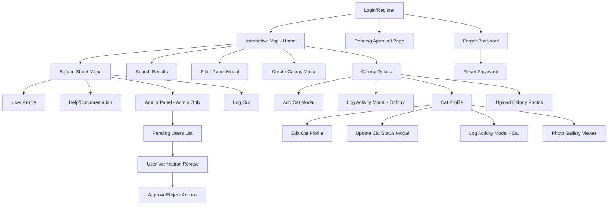
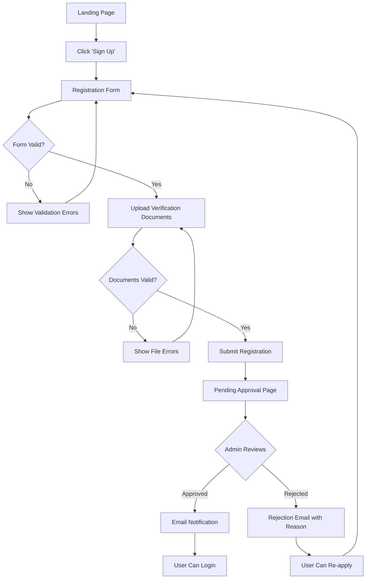
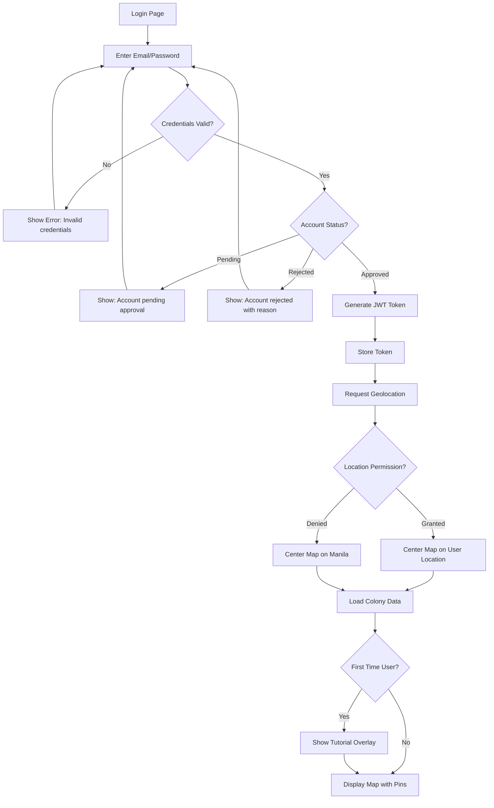
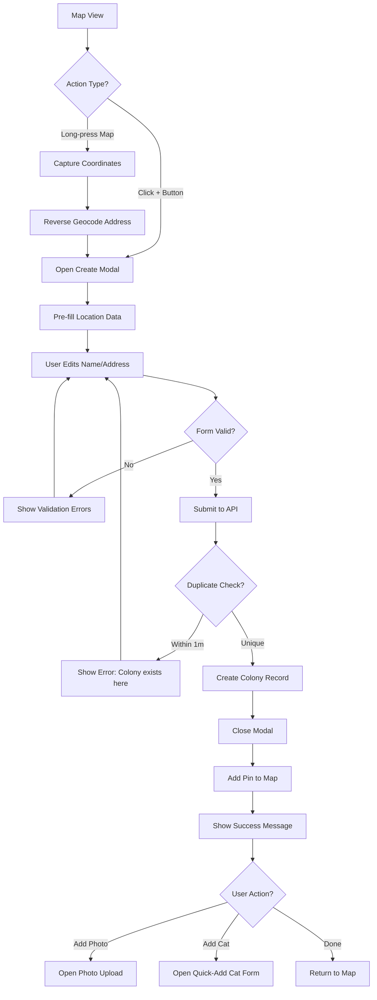
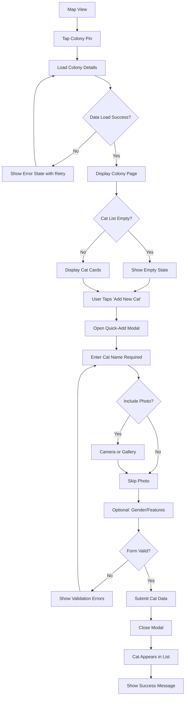
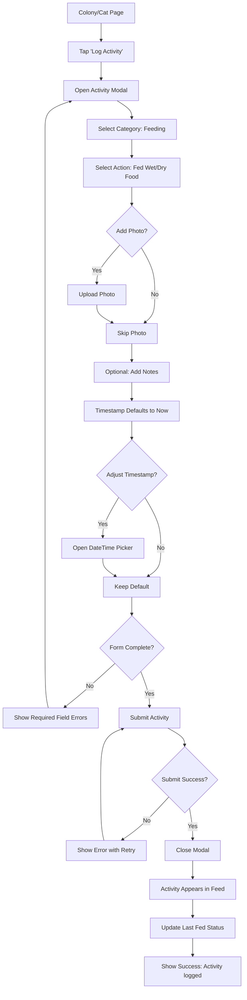
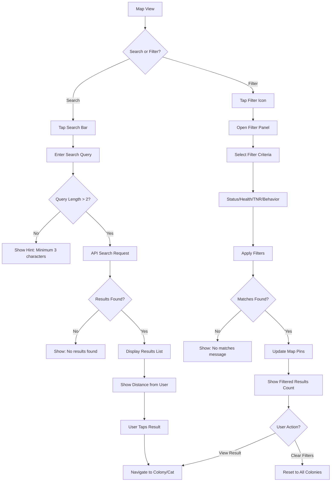
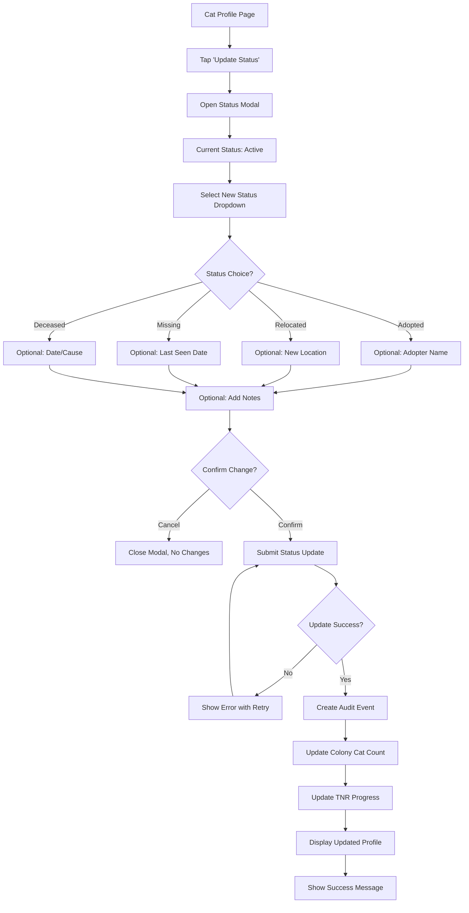

# Paw Patrol UI/UX Specification

This document defines the user experience goals, information architecture, user flows, and visual design specifications for Paw Patrol's user interface. It serves as the foundation for visual design and frontend development, ensuring a cohesive and user-centered experience.

## Change Log

| Date       | Version | Description                    | Author              |
| ---------- | ------- | ------------------------------ | ------------------- |
| 2025-10-28 | 0.1     | Initial UI/UX specification    | Sally (UX Expert)   |

---

## Overall UX Goals & Principles

### Target User Personas

**Primary Persona: Field Volunteer Rescuer**
- Community cat caretakers and rescue volunteers in the Philippines
- Works outdoors in challenging conditions (feeding colonies, TNR operations)
- Needs quick, one-handed mobile access to colony/cat information
- Often non-technical users who prioritize simplicity over advanced features
- Uses smartphone as primary device while in the field

**Secondary Persona: Admin Coordinator**
- Rescue organization administrators who verify new users
- Reviews verification documents and manages user access
- Desktop or mobile access for administrative tasks
- Needs clear oversight tools for community management

### Usability Goals

1. **Speed of data entry:** Common tasks (logging feeding) completed in <10 seconds
2. **One-handed operation:** All critical actions accessible within thumb reach on mobile
3. **Glanceable information:** Key status (feeding, TNR progress) visible without scrolling
4. **Outdoor usability:** High contrast, large touch targets for field conditions
5. **Minimal cognitive load:** Simple tap-only interface suitable for diverse technical skill levels
6. **Fast performance:** Map loads <3 seconds, activity logging <2 seconds (without photos)

### Design Principles

1. **Field-first, not polish-first** - Prioritize practical functionality over aesthetic sophistication; think \"hiking GPS app\" not \"social media feed\"
2. **Photo-forward navigation** - Cat images are primary identification cues; visual recognition over text-heavy lists
3. **Map as home base** - All workflows flow FROM the map; persistent spatial context for colony coordination
4. **Forgiving by design** - Large touch targets, confirmation dialogs for destructive actions, simple error recovery
5. **Every pixel serves purpose** - Utilitarian design with no decorative elements; information density balanced with clarity

---

## Information Architecture (IA)

### Site Map / Screen Inventory



### Navigation Structure

**Primary Navigation:** 
- **Map-centric model** - Map is the persistent home screen and primary navigation hub
- **Hamburger menu (top-left)** opens bottom sheet with: User Profile, Admin Panel (role-restricted), Help, Log Out
- **No traditional nav bar** - keeps screen real estate for map and content

**Secondary Navigation:**
- **Contextual actions via FABs:** '+' button for Add Colony (map), 'Log Activity' button (detail pages)
- **Search bar (top-center)** - always visible on map for quick access
- **Filter icon (top-right)** - toggles filter panel modal

**Modal/Sheet Strategy:**
- **Bottom sheets** for navigation menu (dismissible, temporary)
- **Full-screen modals** for forms (Add Cat, Log Activity, Edit Profile)
- **Overlay modals** for filters and quick actions

**Breadcrumb Strategy:** 
- **Contextual headers only** - No traditional breadcrumbs
- Page headers show context: \"Colony Name > Cat Name\" on Cat Profile
- **Back buttons at every level** for predictable navigation (Map  Colony Details  Cat Profile)
- Maximum 2 levels of actual page navigation (Map  Colony  Cat); modals don't count as navigation depth

**Navigation Depth:**
- Level 0: Login/Register
- Level 1: Map (Home)
- Level 2: Colony Details, Search Results, Admin Panel
- Level 3: Cat Profile, User Verification Review
- Modals: Overlays for actions (don't add to navigation stack except form modals)

---


## User Flows

The following user flows map the critical journeys through the application with decision points and edge cases.

### Flow 1: User Registration & Verification

**User Goal:** Gain access to the platform as a verified rescuer

**Entry Points:** Landing page, login screen "Sign Up" link

**Success Criteria:** User successfully registers, uploads verification documents, and receives approval

#### Flow Diagram



#### Edge Cases & Error Handling:
- **Email already exists:** Show error "This email is already registered" with link to forgot password
- **File upload fails:** Show specific error (file too large, wrong format) with retry option
- **Verification pending:** If user tries to login before approval, show "Account pending review. Check back in 48 hours."
- **Rejection without reason:** System requires admin to provide rejection reason for user clarity
- **Multiple rejections:** Track rejection count; flag suspicious behavior after 3 rejections

---

### Flow 2: Login & Access Map

**User Goal:** Authenticate and access the interactive map home screen

**Entry Points:** Landing page, any protected route (redirects to login)

**Success Criteria:** User successfully logs in and sees map with colony pins

#### Flow Diagram



#### Edge Cases & Error Handling:
- **Network error during login:** Show retry button with error message
- **Token expired:** Auto-redirect to login with message "Session expired, please log in again"
- **Geolocation timeout:** Fall back to Manila after 5-second timeout
- **No colonies exist yet:** Show empty state with "Tap + to add your first colony" guidance
- **Map fails to load:** Show fallback message with "Refresh" button; log error for debugging
- **Browser doesn't support geolocation:** Gracefully fall back to Manila without error

---

### Flow 3: Create New Colony

**User Goal:** Add a new cat colony to the map at a specific location

**Entry Points:** '+' FAB button on map, long-press map location

**Success Criteria:** Colony successfully created and appears as pin on map

#### Flow Diagram



#### Edge Cases & Error Handling:
- **Geocoding API fails:** Allow user to proceed with coordinates only; address optional
- **GPS inaccurate:** Allow manual map pan to adjust pin placement before saving
- **Network error during save:** Show retry option; don't lose form data
- **Duplicate colony detected:** Offer to navigate to existing colony instead
- **User closes modal mid-entry:** Confirm "Discard changes?" before closing
- **Long-press outside Philippines bounds:** Show error "Please select location within Philippines"

---

### Flow 4: View Colony Details & Add Cat

**User Goal:** Navigate to a colony and add a new cat with basic information

**Entry Points:** Tap colony pin on map, search results

**Success Criteria:** User views colony details and successfully adds a cat to the colony

#### Flow Diagram



#### Edge Cases & Error Handling:
- **Colony deleted while viewing:** Show "Colony no longer exists" and redirect to map
- **Network error loading cats:** Show cached data if available, or partial error state
- **Photo upload fails:** Allow user to save cat without photo and retry upload separately
- **Camera permission denied:** Fall back to file upload from gallery
- **Name field empty:** Disable submit button until name entered; show inline error
- **Concurrent cat additions:** Last-write-wins; consider showing conflict notification

---

### Flow 5: Log Feeding Activity

**User Goal:** Record that a colony has been fed to coordinate with other volunteers

**Entry Points:** "Log Activity" button on Colony Details page, "Log Activity" FAB on Cat Profile

**Success Criteria:** Activity logged with timestamp, appears in activity feed, updates "Last Fed" status

#### Flow Diagram



#### Edge Cases & Error Handling:
- **Photo upload timeout:** Allow activity to save without photo; retry photo separately
- **Timestamp in future:** Show warning "Date is in the future" but allow (user may backfill)
- **Duplicate activity within 5 minutes:** Confirm "You just logged feeding. Log again?"
- **Network error during submit:** Queue for retry; show "Will retry when online"
- **User navigates away mid-entry:** Prompt "Save draft?" or "Discard?"
- **Category changed after action selected:** Clear action field and show new options

---

### Flow 6: Search & Filter Colonies

**User Goal:** Find specific colonies or cats based on criteria (location, name, TNR status, etc.)

**Entry Points:** Search bar at top of map, filter icon

**Success Criteria:** User finds relevant colonies/cats and can navigate to them

#### Flow Diagram



#### Edge Cases & Error Handling:
- **Search API timeout:** Show "Search taking too long" with option to retry or refine query
- **No GPS for distance calculation:** Fall back to alphabetical or date-based sorting
- **Filter returns zero results:** Suggest relaxing criteria; show "Clear filters" button
- **Search while filter active (MVP):** Clear filter when search begins; show notification "Filters cleared"
- **Network error during search:** Cache recent searches; allow offline browsing of cached results
- **Special characters in search:** Sanitize input; handle apostrophes, accents gracefully

---

### Flow 7: Update Cat Status (Active  Adopted)

**User Goal:** Mark a cat as adopted and remove from active colony population

**Entry Points:** "Update Status" button on Cat Profile page

**Success Criteria:** Cat status changed, reflected in colony cat count and TNR progress, activity logged

#### Flow Diagram



#### Edge Cases & Error Handling:
- **Concurrent status updates:** Last-write-wins; show notification if profile changed since load
- **Status change to Deceased:** Show confirmation dialog "This action cannot be undone. Continue?"
- **Network error during save:** Show retry; don't navigate away until confirmed
- **Missing required context:** For "Relocated," prompt for new location to maintain colony tracking
- **Status reverted:** Allow admin to revert status changes via audit log (post-MVP)
- **Adopted cat with medical alerts:** Warn "Cat has active medical alerts. Ensure adopter is informed."

---


## Wireframes & Mockups

### Primary Design Files

**Primary Design Files:** To be created in Figma (or design tool of choice) after this specification is finalized

**Design File Organization:**
- **File Name:** `Paw Patrol - UI/UX Design v1`
- **Pages Structure:**
  - Authentication Flow (Login, Register, Pending Approval)
  - Map & Navigation (Map Home, Bottom Sheet Menu, Search/Filter)
  - Colony Management (Colony Details, Create Colony, Photo Upload)
  - Cat Management (Cat Profile, Add Cat, Edit Cat, Status Update)
  - Activity Logging (Activity Modal, Activity Feed)
  - Admin Panel (Pending Users, Verification Review)
- **Component Library Page:** All reusable components cataloged

**Note:** The wireframes below are conceptual layouts. Detailed visual designs with actual Untitled UI components should be created in Figma for developer handoff.

---

### Key Screen Layouts

#### Screen 1: Interactive Map (Home Screen)

**Purpose:** Primary navigation hub and spatial overview of all cat colonies

**Key Elements:**
- **Map viewport** - Full screen (Google Maps integration)
- **User location indicator** - Blue dot with accuracy circle
- **Colony pins** - Circular photo thumbnails or default cat icons at GPS coordinates
- **Hamburger menu icon** - Top-left corner (opens bottom sheet)
- **Search bar** - Top center, always visible, placeholder: "Search colonies, cats, or location"
- **Filter icon** - Top-right corner (badge showing active filter count if filters applied)
- **'+' FAB** - Bottom-right corner, primary action color
- **Tutorial overlay** (first-time users only) - Semi-transparent overlay with "Welcome! Tap + to add your first colony" message and dismiss button

**Layout Zones:**
```
┌─────────────────────────────────────┐
│ [☰]  [Search bar...]         [⚙]  │ ← Header (overlays map)
├─────────────────────────────────────┤
│                                     │
│        [Map Viewport]               │
│      ●Colony Pin                    │
│            ●Pin                     │
│    ●Pin         ●Pin                │
│                                     │
│          ⊙User                     │
│                                     │
│                             [+]     │ ← FAB
└─────────────────────────────────────┘
```

**Interaction Notes:**
- **Tap colony pin:** Navigate to Colony Details
- **Long-press map (500ms):** Create colony at that location
- **Tap search bar:** Activate search with keyboard
- **Tap filter icon:** Open filter panel modal
- **Tap '+' FAB:** Open create colony modal
- **Tap hamburger menu:** Open bottom sheet navigation
- **Pinch/zoom:** Standard map zoom behavior
- **Pan:** Standard map pan behavior

**Responsive Behavior:**
- Mobile (320-428px): Full screen map, search bar shrinks to icon on very small screens
- Tablet (768px+): Search bar wider, pins slightly larger for easier tapping
- Desktop (1024px+): Search bar max-width, mouse hover shows colony preview tooltip

**Design File Reference:** `Figma Frame: 1.0 Map Home`

---

#### Screen 2: Bottom Sheet Navigation Menu

**Purpose:** Access user profile, help, admin panel, and logout

**Key Elements:**
- **Overlay backdrop** - Semi-transparent dark overlay (dismissible)
- **Bottom sheet container** - Slides up from bottom, rounded top corners
- **Drag handle** - Horizontal pill indicator at top (for drag-to-dismiss)
- **User profile section**:
  - Profile photo or avatar icon
  - User name (bold)
  - Email (secondary text)
  - Role badges (e.g., "Admin" badge if applicable)
- **Menu items**:
  - Help icon + "Help & Documentation"
  - Admin icon + "Admin Panel" (visible only to ADMIN/SUPER_ADMIN roles)
  - Logout icon + "Log Out" (danger color)
- **Close button** - X icon in top-right of sheet

**Layout:**
```

 [Map with dark overlay]     
                             
     
                        Drag handle
     John Smith          Profile + Close
    john@email.com        
    [Admin Badge]         
       
     Help               
     Admin Panel          Role-restricted
     Log Out            
     

```

**Interaction Notes:**
- **Tap outside sheet:** Dismiss and return to map
- **Drag handle down:** Dismiss with animation
- **Tap X button:** Dismiss
- **Tap Help:** Navigate to help/documentation page
- **Tap Admin Panel:** Navigate to admin pending users list (if authorized)
- **Tap Log Out:** Clear JWT token, redirect to login
- **Swipe down:** Alternative dismiss gesture

**Responsive Behavior:**
- Mobile: Sheet covers bottom 40% of screen
- Tablet/Desktop: Sheet max-width 400px, centered at bottom

**Design File Reference:** `Figma Frame: 1.1 Bottom Sheet Menu`

---

#### Screen 3: Colony Details Page

**Purpose:** Central hub for all colony information and cat management

**Key Elements:**
- **Header bar**:
  - Back arrow (left)  Returns to map
  - Colony name (editable inline, pencil icon)
  - Edit colony button (top-right)
- **Key metrics card**:
  - Cat count: "12 cats"
  - TNR progress bar: "8 of 12 neutered (67%)"
  - Last fed status: "Last Fed: Today at 8:30 AM" (green if today, amber if yesterday, red if 2+ days)
- **Cat list section**:
  - Section header: "Cats in this Colony"
  - Scrollable cards, each showing:
    - Circular photo thumbnail (skeleton loader while loading)
    - Cat name (bold)
    - Gender icon + status badge
    - Medical alert icon (if medicalAlert=true)
  - Empty state: "No cats yet. Tap 'Add New Cat' to start."
- **Activity log section**:
  - Section header: "Recent Activity" with filter dropdown (Today/All Time/Date Range)
  - Chronological feed of activities (newest first):
    - User avatar + name
    - Activity type icon + description
    - Timestamp (relative: "2 hours ago")
    - Optional: Photo thumbnail
    - Optional: Notes preview (expandable)
  - Empty state: "No activities logged yet."
- **Action buttons**:
  - "Add New Cat" button (prominent, top of cat list)
  - "Log Activity" FAB (bottom-right, always visible)

**Layout:**
```
┌─────────────────────────────────────┐
│ [←]  Colony Name              [⋮]  │ ← Header
├─────────────────────────────────────┤
│ 🐱 12 cats | 📊 TNR 67%             │
│ ✅ Last Fed: Today 8:30 AM          │ ← Metrics
├─────────────────────────────────────┤
│ Cats in this Colony                 │
│ [+ Add New Cat]                     │
│                                     │
│  ┌──────────────────────────────┐  │
│  │ ●  Whiskers     ♂️ [Active]  │  │ ← Cat card
│  └──────────────────────────────┘  │
│  ┌──────────────────────────────┐  │
│  │ ●  Mittens      ♀️ [Active]  │  │
│  └──────────────────────────────┘  │
│                                     │
│ Recent Activity        [Today ▼]    │
│  ● Jane fed wet food                │
│    2 hours ago                      │
│  ● John added cat "Shadow"          │
│    Yesterday at 3:15 PM             │
│                             [✏️]    │ ← FAB
└─────────────────────────────────────┘
```

**Interaction Notes:**
- **Tap back arrow:** Return to map
- **Tap colony name:** Inline edit mode (text input + save/cancel)
- **Tap cat card:** Navigate to Cat Profile page
- **Tap "Add New Cat":** Open quick-add modal
- **Tap "Log Activity" FAB:** Open activity logging modal (colony-level)
- **Tap activity item:** Expand to show full notes/photos
- **Tap filter dropdown:** Select time range for activity log
- **Scroll:** Infinite scroll or pagination for long activity logs

**Responsive Behavior:**
- Mobile: Single column, cat cards full-width
- Tablet: Cat cards in 2-column grid
- Desktop: Cat cards in 3-column grid, activity log side-by-side

**Design File Reference:** `Figma Frame: 2.0 Colony Details`

---

#### Screen 4: Cat Profile Page

**Purpose:** Comprehensive view of individual cat information and history

**Key Elements:**
- **Header bar**:
  - Back arrow  Returns to Colony Details
  - Cat name
  - Status badge (color-coded: green=Active, blue=Adopted, etc.)
- **Hero photo section**:
  - Large primary photo (tap to expand gallery)
  - Photo count indicator: "3 photos" (bottom-right overlay)
  - Skeleton loader while loading
- **Collapsible sections** (accordion pattern):
  - **Basic Info** 
    - Name, Gender, Age Range, Distinguishing Features
    - Edit button (top-right of section)
  - **Health Info** 
    - Medical Alert toggle (prominent if ON)
    - Last Vet Visit, Medications, Known Conditions
    - Edit button
  - **TNR Info** 
    - Neutered status (Yes/No/Unknown)
    - Neuter date, TNR Organization
    - Edit button
  - **Behavioral Info** 
    - Temperament tags (chips: Friendly, Shy, etc.)
    - Interaction notes
    - Edit button
  - **History** 
    - Date First Sighted, Origin Story
    - Edit button
- **Cat-specific activity log**:
  - Same format as colony activity log
  - Filtered to this cat only
- **Action buttons**:
  - "Update Status" button (below hero photo)
  - "Log Activity" FAB (cat-specific actions)

**Layout:**
```
┌─────────────────────────────────────┐
│ [←]  Whiskers           [Active]    │ ← Header
├─────────────────────────────────────┤
│        [Large Photo]                │
│        (Tap to expand)              │
│                    3 photos         │ ← Hero
│                                     │
│   [Update Status Button]            │
├─────────────────────────────────────┤
│ ▼ Basic Info                    [✏] │
│   Gender: Male                      │
│   Age: Adult (2-7 yrs)              │
│   Features: White paws...           │
├─────────────────────────────────────┤
│ ▼ Health Info                   [✏] │
│   ⚠️ Medical Alert ON               │
│   Medications: Antibiotics          │
├─────────────────────────────────────┤
│ ▶ TNR Info                      [✏] │ ← Collapsed
├─────────────────────────────────────┤
│ Cat Activity Log                    │
│  ● Jane gave medication             │
│    3 hours ago                      │
│                             [✏️]    │ ← FAB
└─────────────────────────────────────┘
```
    Medical Alert ON       
   Medications: Antibiotics  

  TNR Info                 Collapsed

 Cat Activity Log            
  Jane gave medication     
    3 hours ago              
                         []  FAB

```

**Interaction Notes:**
- **Tap back arrow:** Return to Colony Details
- **Tap hero photo:** Open full-screen photo gallery (swipe navigation)
- **Tap "Update Status":** Open status change modal
- **Tap section header:** Expand/collapse accordion section
- **Tap Edit button:** Open edit modal for that section
- **Tap "Log Activity" FAB:** Open activity modal (cat-specific)
- **Scroll:** Standard page scroll

**Responsive Behavior:**
- Mobile: Single column, hero photo 100% width
- Tablet/Desktop: Hero photo max-width 600px, centered, sections wider

**Design File Reference:** `Figma Frame: 3.0 Cat Profile`

---


#### Screen 5-10: Additional Key Screens

**Screen 5: Add/Edit Cat Form (Modal)**
- Modal header with title and close button
- Required fields: Name, Gender
- Optional fields: Photo upload, Distinguishing features, Age range
- Collapsible Advanced Fields section
- Cancel and Save buttons

**Screen 6: Log Activity Form (Modal)**
- Category dropdown (Feeding/Health/Environment)
- Conditional Action dropdown
- Optional notes text area
- Photo upload (max 3)
- Timestamp picker (defaults to now)
- Submit button

**Screen 7: Search Results Screen**
- Header with editable search input
- Results list sorted by distance
- Each result shows: photo, name, address/context, distance
- Tap result to navigate
- Empty state for no results

**Screen 8: Filter Panel (Modal/Drawer)**
- Categorized filter sections
- Status, Health & Feeding, TNR, Behavior, Basic Info filters
- Checkboxes/toggles for options
- Apply Filters and Clear All buttons

**Screen 9: Registration/Login Screens**
- Standard email/password forms
- File upload for verification documents
- Validation messages
- Pending approval status page post-registration

**Screen 10: Admin Verification Panel**
- Pending users list with Review buttons
- Document viewer with inline images
- Approve/Reject actions with confirmation

---

## Component Library / Design System

### Design System Approach

**Design System Approach:** Utilize **Untitled UI** component library as the foundation, customized for Paw Patrol's field-optimized, mobile-first requirements.

**Strategy:**
- Adopt Untitled UI's base components for common patterns
- Customize component variants for domain-specific needs
- Extend with custom components where Untitled UI doesn't provide solutions
- Document deviations from Untitled UI defaults

---

### Core Components

#### Component: Button

**Purpose:** Primary interaction element for actions and navigation

**Variants:**
- Primary: High-emphasis actions (Save Cat, Log Activity)
- Secondary: Medium-emphasis actions (Cancel, Clear All)
- Danger: Destructive actions (Delete Colony, Reject User)
- Ghost: Low-emphasis actions (Skip, Dismiss)
- FAB: Persistent primary action (+ Add Colony,  Log Activity)

**States:** Default, Hover, Active, Disabled, Loading

**Usage Guidelines:**
- Primary buttons: One per screen/modal
- Touch targets: Minimum 44x44px
- Button text: Action verbs (Save, Log, Add)

---

#### Component: Form Input

**Purpose:** Text entry fields for user data collection

**Variants:** Text Input, Text Area, Dropdown/Select, Date Picker, File Upload

**States:** Default, Focus, Filled, Error, Disabled, Read-only

**Usage Guidelines:**
- Labels always visible above input
- Required indicators: Red asterisk (*)
- Real-time validation on blur
- Inline error messages below field

---

#### Component: Modal / Bottom Sheet

**Purpose:** Temporary overlays for forms, actions, and navigation

**Variants:** Full Modal, Bottom Sheet, Filter Panel

**States:** Entering, Open, Closing, Hidden

**Usage Guidelines:**
- Semi-transparent backdrop (60% opacity)
- Multiple dismiss methods (X, tap outside, drag down)
- Focus trap for keyboard navigation
- Scrollable body content

---

#### Component: Card

**Purpose:** Container for related information and preview content

**Variants:** Cat Card, Colony Card, Activity Card, Metrics Card

**States:** Default, Hover, Active, Selected

**Usage Guidelines:**
- Full card is interactive area
- Visual hierarchy: Photo > Title > Secondary text > Metadata
- Consistent padding (16px mobile, 20px desktop)

---

#### Component: Badge / Status Indicator

**Purpose:** Compact status and category identification

**Variants:** Status Badge, Role Badge, Count Badge, Alert Badge

**Color Coding:**
- Green: Active, Neutered, Fed Today
- Blue: Informational, Relocated
- Amber: Warning, Not Fed Today, Missing
- Red: Critical, Deceased, Medical Alert
- Gray: Neutral, Unknown

---

#### Component: Photo Gallery

**Purpose:** Display and manage multiple photos

**Variants:** Thumbnail Grid, Lightbox Viewer, Upload Preview

**Usage Guidelines:**
- Lazy loading for performance
- Square thumbnails (1:1 aspect ratio)
- Tap thumbnail to open lightbox
- Swipe navigation in lightbox

---

#### Component: Navigation

**Purpose:** Primary and secondary navigation patterns

**Variants:** Top Bar, Bottom Sheet Menu, Search Bar, Breadcrumbs

**Usage Guidelines:**
- Top bar always visible
- Large tap targets (44x44px)
- Thumb-reachable placement on mobile

---

#### Component: Activity Log Entry

**Purpose:** Display individual activity in chronological feed

**Variants:** User Activity, System Audit

**Usage Guidelines:**
- User avatar + name + action + timestamp
- Color-coded icons by category
- Relative timestamps for recent activities
- Tap to expand notes/photos

---

#### Component: Map Pin / Marker

**Purpose:** Represent colony locations on interactive map

**Variants:** Photo Pin, Default Icon Pin, User Location Marker, Cluster Marker

**Usage Guidelines:**
- 48x48px for photo pins
- Circular crop with border
- Clustering activates when >20 pins

---

#### Component: Progress Indicator

**Purpose:** Show TNR progress and loading states

**Variants:** Progress Bar, Spinner, Skeleton Loader

**Usage Guidelines:**
- Progress bar includes text label
- Spinner during button actions
- Skeleton loaders match actual content layout

---

## Branding & Style Guide

### Visual Identity

**Brand Guidelines:** No formal branding for MVP - using Untitled UI defaults

**Color Palette:**

| Color Type | Hex Code | Usage |
|------------|----------|-------|
| Primary | Untitled UI Default | Primary actions, links |
| Success | #10B981 (Green) | Positive states (fed, healthy, neutered) |
| Warning | #F59E0B (Amber) | Cautions, needs attention |
| Error | #EF4444 (Red) | Errors, critical alerts, destructive actions |
| Info | #3B82F6 (Blue) | Informational, audit events |
| Neutral | Gray scale | Text, borders, backgrounds |

### Typography

**Font Families:**
- Primary: System fonts (-apple-system, Roboto, system-ui)
- Monospace: For code/technical display if needed

**Type Scale:**

| Element | Size | Weight | Line Height |
|---------|------|--------|-------------|
| H1 | 32px | Bold | 1.2 |
| H2 | 24px | Semibold | 1.3 |
| H3 | 20px | Semibold | 1.4 |
| Body | 16px | Regular | 1.5 |
| Small | 14px | Regular | 1.4 |

### Iconography

**Icon Library:** Material Design Icons or Untitled UI icon set

**Usage Guidelines:** Consistent 24x24px size for UI icons, larger for feature icons

### Spacing & Layout

**Grid System:** 8px base unit grid

**Spacing Scale:** 4px, 8px, 12px, 16px, 20px, 24px, 32px, 48px, 64px

---

## Accessibility Requirements

### Compliance Target

**Standard:** None (no formal WCAG compliance for MVP)

**Rationale:** Prioritizing speed to market for pilot testing. Basic best practices followed but no formal accessibility audit.

**Post-MVP Consideration:** Implement WCAG AA compliance if platform scales

### Key Requirements

**Visual:**
- Color contrast ratios: Sufficient for outdoor visibility (no formal testing)
- Focus indicators: Visible on interactive elements
- Text sizing: Readable at default browser settings

**Interaction:**
- Keyboard navigation: Supported for all critical functions
- Touch targets: Minimum 44x44px (iOS HIG guideline)

**Content:**
- Alternative text: Provided for images where applicable
- Form labels: Always visible

---

## Responsiveness Strategy

### Breakpoints

| Breakpoint | Min Width | Max Width | Target Devices |
|------------|-----------|-----------|----------------|
| Mobile | 320px | 767px | Smartphones |
| Tablet | 768px | 1023px | iPads, Android tablets |
| Desktop | 1024px | 1439px | Laptops, smaller desktops |
| Wide | 1440px | - | Large desktops |

### Adaptation Patterns

**Layout Changes:**
- Mobile: Single column, full-width components
- Tablet: 2-column grids where appropriate
- Desktop: 3-column grids, side-by-side layouts

**Navigation Changes:**
- Mobile: Bottom sheet for main menu, FABs for actions
- Desktop: Persistent sidebar consideration post-MVP

**Content Priority:**
- Mobile: Most critical information above fold
- Progressive disclosure for secondary content

**Interaction Changes:**
- Mobile: Touch-optimized (large targets, swipe gestures)
- Desktop: Mouse hover states, keyboard shortcuts

---

## Animation & Micro-interactions

### Motion Principles

**Design Philosophy:** Subtle, functional animations that provide feedback without distraction

**Key Principles:**
- Fast and responsive (200-300ms for most transitions)
- Easing: Use natural curves (ease-out for entrances, ease-in for exits)
- Purpose-driven: Every animation serves user understanding

### Key Animations

- **Modal/Sheet entrance:** Slide up from bottom with fade-in backdrop (300ms, ease-out)
- **Button press:** Brief scale down (100ms) with haptic feedback on mobile
- **Loading spinners:** Smooth rotation with 1s duration
- **List item addition:** Fade in + slide down (250ms)
- **Success feedback:** Brief checkmark animation + color pulse
- **Error shake:** Horizontal shake for invalid form submission
- **Photo gallery swipe:** Smooth horizontal transition with momentum

---

## Performance Considerations

### Performance Goals

- **Page Load:** Map loads <3 seconds on 4G (NFR1)
- **Interaction Response:** Activity logging <2 seconds without photos (NFR2)
- **Animation FPS:** Maintain 60fps for all animations

### Design Strategies

**Image Optimization:**
- Resize uploads to max 1920px width
- Compress to 80% JPEG quality
- Generate thumbnails (200x200px) for listings
- Lazy load images below fold

**Component Optimization:**
- Virtualize long lists (cat lists, activity feeds)
- Debounce search input (300ms delay)
- Skeleton loaders for perceived performance

**Map Performance:**
- Marker clustering for >20 pins
- Lazy load colony details on pin tap
- Cache map tiles when possible

---

## Next Steps

### Immediate Actions

1. **Review & Approve Specification** - Stakeholder review of this document
2. **Create Visual Designs** - Translate wireframes to high-fidelity Figma designs using Untitled UI
3. **Component Cataloging** - Build Storybook or component documentation for developers
4. **Design Handoff** - Prepare assets and specifications for Design Architect
5. **Begin Epic 1 Development** - Foundation & Authentication implementation

### Design Handoff Checklist

- [x] All user flows documented
- [x] Component inventory complete
- [x] Accessibility requirements defined
- [x] Responsive strategy clear
- [x] Brand guidelines incorporated
- [x] Performance goals established

---

**Document Status:** Complete - Ready for stakeholder review and Figma design phase

**Next Review:** Design Architect to create frontend architecture specification based on this UX spec

